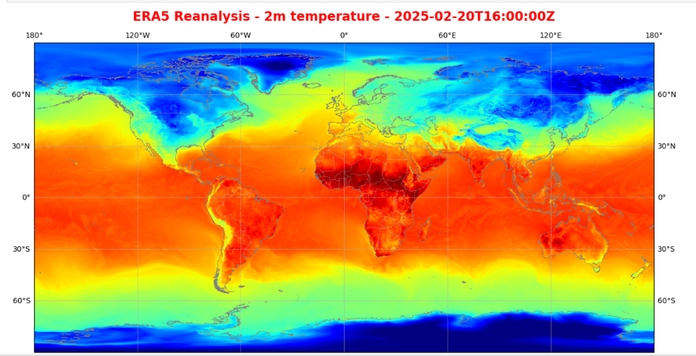

**REVISION HISTORY**

<table>
<colgroup>
<col style="width: 14%" />
<col style="width: 20%" />
<col style="width: 22%" />
<col style="width: 41%" />
</colgroup>
<thead>
<tr>
<th style="text-align: center;">Revision</th>
<th style="text-align: center;">Date</th>
<th style="text-align: center;">Author(s)</th>
<th style="text-align: center;">Description</th>
</tr>
</thead>
<tbody>
<tr>
<td>1.0</td>
<td>28/01/2024</td>
<td>Murmuration</td>
<td style="text-align: left;">Initial version</td>
</tr>
<tr>
<td>1.1</td>
<td>04/02/2025</td>
<td>Murmuration, Mozaika, Sistema</td>
<td style="text-align: left;">Test case table initialised</td>
</tr>
<tr>
<td>1.2</td>
<td>27/02/2025</td>
<td>Sistema, Murmuration</td>
<td style="text-align: left;">
Section 2 updated

Section 4.3 added
</td>
</tr>
<tr>
<td>1.3</td>
<td>24/07/2025</td>
<td>Murmuration</td>
<td style="text-align: left;">
Update for RR4:

<ul>
<li>
3 Integration &amp; Deployment on DESP
</li>
</ul></td>
</tr>
</tbody>
</table>

**Table of content**

[1 Introduction [3](#introduction)](#introduction)

[1.1 Purpose of the document
[3](#purpose-of-the-document)](#purpose-of-the-document)

[1.2 Context of the project
[3](#context-of-the-project)](#context-of-the-project)

[2 Context [4](#context)](#context)

[3 Integration & Deployment on DESP
[6](#integration-deployment-on-desp)](#integration-deployment-on-desp)

[4 DESP Features Verification Tests
[11](#desp-features-verification-tests)](#desp-features-verification-tests)

[4.1 Federated applications IAM integration
[11](#federated-applications-iam-integration)](#federated-applications-iam-integration)

[4.2 DESP Services & Data Access
[12](#monitoring-destine-ops-integration)](#monitoring-destine-ops-integration)

[4.2.1 Insula [12](#insula)](#insula)

[4.2.2 Data Cache Management service (DCMS)
[14](#data-cache-management-service-dcms)](#data-cache-management-service-dcms)

[4.2.3 Eden [16](#eden)](#eden)

[4.2.4 HDA [17](#hda)](#hda)

[4.2.5 Polytope [18](#polytope)](#polytope)

[4.3 CCADT usage in Sea level rise and storm surges component
[20](#ccadt-usage-in-sea-level-rise-and-storm-surges-component)](#ccadt-usage-in-sea-level-rise-and-storm-surges-component)

[4.3.1 Data retrieval [20](#data-retrieval)](#data-retrieval)

[4.3.2 Integration of CCADT data
[21](#integration-of-ccadt-data)](#integration-of-ccadt-data)

[4.3.3 Other types of data integration
[25](#other-types-of-data-integration)](#other-types-of-data-integration)

**Test cases**

[Table 1: US-TC-001 Deployment of the air quality application
[6](#_Toc191650837)](#_Toc191650837)

[Table 2: US-TC-002 Usage of the air quality application
[7](#_Toc191650838)](#_Toc191650838)

[Table 3: US-TC-003 Federated authentication without JWT token
[11](#_Toc191650839)](#_Toc191650839)

[Table 4: US-TC-004 Federated authentication with valid JWT token
[11](#_Toc191650840)](#_Toc191650840)

[Table 5: US-TC-005 Federated authentication with invalid JWT token
[12](#_Toc191650841)](#_Toc191650841)

[Table 6: US-TC-006 Accessing DestinE data using Insula Code
[12](#_Toc191650842)](#_Toc191650842)

[Table 7: US-TC-007 Accessing DestinE data using Data Cache Management
service [14](#_Toc191650843)](#_Toc191650843)

[Table 8: US-TC-008 Retrieve data from EDEN
[16](#_Toc191650844)](#_Toc191650844)

[Table 9: US-TC-009 Accessing DestinE data using HDA API
[17](#_Toc191650845)](#_Toc191650845)

[Table 10: US-TC-010 Retrieve data from polytope
[18](#_Toc191650846)](#_Toc191650846)

[Table 11: US-TC-011 Retrieval of sea level height data from the CCADT
[20](#_Toc191650847)](#_Toc191650847)

# Introduction

## Purpose of the document

This document presents the integration, verification and validation
(IVV) report for the UrbanSquare system, deployed on top of the DestinE
platform services.

It presents the status of the UrbanSquare deployment on top of DestinE,
the problems faced by the integration team, and the lesson learned.

## Context of the project

The goal of UrbanSquare is to provide operational tools to urban
planners, enabling them to assess the exposure of their territory and
plan to adapt to these risks. For that monitoring capacities are
provided to understand the historical and current situation as well as
projection capacities to plan future actions

UrbanSquare is organised along six components, developed by a consortium
of three companies: Murmuration, Sistema and Mozaika. Each component
covers the exposure of a specific climate risk to urban areas.

# Context

UrbanSquare is designed to be an unified service built on top of DestinE
Software Platform services.

At this stage in development, it relies on DestinE user management
system (IAM) and on different endpoints provided to access data.

<figure>

<figcaption>
Figure 1: Interfaces between UrbanSquare and DestinE
Software Platform
</figcaption>
</figure>

UrbanSquare is composed of different components. Each component tackles
a specific risk to urban areas.

Three component are directly deployed as application on DestinE cloud
platform:

- Air quality

- Urban heat

- Sea level rise and storm surges

A fourth one, the Flood and Resources component, is deployed on premises
outside of the DestinE cloud platform. A proxy module ensures the
federation with the DestinE IAM system and the access to the DestinE
data sources.

<figure>

<figcaption>
Figure 2: UrbanSquare components high-level
architecture.
</figcaption>
</figure>

# Integration & Deployment on DESP

The UrbanSquare applications are deployed in the OVH cloud environment.

DestinE allows different configurations to deploy a service to OVH:

- Being deployed in the DestinE Runtime Platform (e.g. Kubernetes
  managed cluster), managed by the DestinE operation team

- Being deployed in the service provider OVH tenant, managed by the
  service provider

  The second option has been favoured for UrbanSquare. It is deployed in
  the Murmuration’s OVH tenant.

<table>
<caption>
Table 1:
US-TC-001 Deployment of the air quality application
</caption>
<colgroup>
<col style="width: 21%" />
<col style="width: 78%" />
</colgroup>
<thead>
<tr>
<th>Test Case ID</th>
<th>US-TC-001</th>
</tr>
</thead>
<tbody>
<tr>
<td>Test Case Name</td>
<td>Deployment of the air quality application</td>
</tr>
<tr>
<td>Objective</td>
<td>Verify that a component application can be deployed on the
UrbanSquare infrastructure platform, deployed on top of Destination
Earth OVH cloud environment.</td>
</tr>
<tr>
<td>Preconditions</td>
<td><ul>
<li>
The UrbanSquare Kubernetes platform has been deployed and is
ready to host applications
</li>
<li>
A Kubernetes namespace is created on the Kubernetes cluster for
the application, its name will be referred to as air-quality-ns in in
this document.
</li>
<li>
The <a
href="https://kubernetes.io/docs/reference/kubectl/kubectl/">kubectl</a>
command-line client is <a
href="https://kubernetes.io/docs/tasks/tools/#kubectl">installed and
configured</a> on your workstation with access credentials to the
UrbanSquare Kubernetes platform.
</li>
<li>
The Air quality application’s Kubernetes manifest is configured
to be able to connect with DestinE IAM
</li>
</ul></td>
</tr>
<tr>
<td>Test Steps</td>
<td><ol type="1">
<li>
Retrieve the Air quality application Kubernetes manifest as a
yaml file, and store it locally in as air-quality.yaml
</li>
<li>
Apply the manifest to deploy the application by
executing:
</li>
</ol>

kubectl apply -n air-quality-ns air-quality.yaml

The output should look like this:

deployment.apps/urban-square-air created

service/urban-square-air created

ingress.networking.k8s.io/dashboard-air created

<ol start="3" type="1">
<li>
Verify that the deployment was created successfully:
</li>
</ol>

kubectl get deployments -n air-quality-ns

The output should look like this:

<ol start="4" type="1">
<li>
Check the status of the pods, repeatedly, until it reaches the
status Running (the acceptable transitional statuses are Pending and
ContainerCreating), by running:
</li>
</ol>

kubectl get pods -n air-quality-ns --watch

The final output should look like this:

</td>
</tr>
<tr>
<td>Expected Results</td>
<td><ul>
<li>
The application is up and running
</li>
<li>
The application can be accessed at:

<a
href="https://destinationearth.murmureo.com/urban-square/air-quality/toulouse/">https://destinationearth.murmureo.com/urban-square/air-quality/toulouse/</a>
</li>
<li>
A user with a valid DestinE account can connect to the
application
</li>
</ul></td>
</tr>
<tr>
<td>Pass/Fail Criteria</td>
<td><ul>
<li>
<strong>Pass</strong>: if the application can be accessed on the
URL provided above
</li>
<li>
<strong>Fail:</strong> If the URL above returns an error
</li>
</ul></td>
</tr>
<tr>
<td>Test Environment</td>
<td><ul>
<li>
Cloud platform: Destination Earth OVH environment (Murmuration
tenant)
</li>
<li>
Kubernetes platform
</li>
<li>
DestinE IAM system
</li>
</ul></td>
</tr>
<tr>
<td>Test Data</td>
<td><ul>
<li>
N/A
</li>
</ul></td>
</tr>
<tr>
<td>Remarks</td>
<td><ul>
<li>
Ensure network access to DestinE IAM before running the
test.
</li>
</ul></td>
</tr>
</tbody>
</table>

<table>
<caption>
Table 2:
US-TC-002 Usage of the air quality application
</caption>
<colgroup>
<col style="width: 21%" />
<col style="width: 78%" />
</colgroup>
<thead>
<tr>
<th>Test Case ID</th>
<th>US-TC-002</th>
</tr>
</thead>
<tbody>
<tr>
<td>Test Case Name</td>
<td>Usage of air quality application</td>
</tr>
<tr>
<td>Objective</td>
<td>Verify that the component application is correctly deployed and can
access the required datasets.</td>
</tr>
<tr>
<td>Preconditions</td>
<td><ul>
<li>
US-TC-001 has been passed
</li>
</ul></td>
</tr>
<tr>
<td>Test Steps</td>
<td><ol type="1">
<li>
Open the URL of the pilot service :
</li>
</ol>

<a
href="https://destinationearth.murmureo.com/urban-square/air-quality/toulouse/">https://destinationearth.murmureo.com/urban-square/air-quality/toulouse/</a>

<ol start="2" type="1">
<li>
If the user is not already connected, the connection page
appears. Provide a DestinE user/password to enter the service
(registration can be done on <a
href="https://platform.destine.eu/">https://platform.destine.eu/</a>).
</li>
</ol>

<ol start="3" type="1">
<li>
The landing page of the service is displayed. By default the map
of the average NO2 concentration from January 1st 2023 to the
last available date is displayed over the whole area. A graphs showing
the daily evolution of the NO2 concentration over this period is also
displayed.
</li>
</ol>

<ol start="4" type="1">
<li>
A setting panel can be open on the left. Provide the following
configuration and then click on “Validate settings”:
</li>
</ol>
<ul>
<li>
Variable: Number of overshoots
</li>
<li>
Date Range: 2024/01/01 to 2024/01/31
</li>
<li>
Time series settings: Day
</li>
<li>
Air quality standard: WHO
</li>
<li>
Zone selection: blanks

</li>
</ul>
<ol start="5" type="1">
<li>
The map and the graphs are updated as follow:
</li>
</ol>

<ol start="6" type="1">
<li>
Provide the following configuration and then click on “Validate
settings”:
</li>
</ol>
<ul>
<li>
Variable: Number of overshoots
</li>
<li>
Date Range: 2023/01/01 to 2023/12/31
</li>
<li>
Time series settings: Month
</li>
<li>
Air quality standard: ANSES
</li>
<li>
Zone selection: Blagnac
</li>
</ul>
<ol start="7" type="1">
<li>
The map and the graphs are updated as follow:
</li>
</ol>

</td>
</tr>
<tr>
<td>Expected Results</td>
<td><ul>
<li>
The dashboard display the expected map and graphs.
</li>
</ul></td>
</tr>
<tr>
<td>Pass/Fail Criteria</td>
<td><ul>
<li>
<strong>Pass</strong>: if the application display the expected
maps and graphs
</li>
<li>
<strong>Fail:</strong> If errors occur when providing the given
configurations, or if the information displayed is not compliant with
the provided reference screenshots.
</li>
</ul></td>
</tr>
<tr>
<td>Test Environment</td>
<td><ul>
<li>
Cloud platform: Destination Earth OVH environment (Murmuration
tenant)
</li>
<li>
Kubernetes platform
</li>
<li>
DestinE IAM system
</li>
<li>
S3 storage
</li>
<li>
Air quality application
</li>
</ul></td>
</tr>
<tr>
<td>Test Data</td>
<td><ul>
<li>
Air quality data in Toulouse: CAMS and super-resolution
datasets
</li>
</ul></td>
</tr>
<tr>
<td>Remarks</td>
<td><ul>
<li>
Ensure network access to S3 storage before running the
test.
</li>
</ul></td>
</tr>
</tbody>
</table>

# DESP Features Verification Tests

## Federated applications IAM integration 

<table>
<caption>
Table 3:
US-TC-003 Federated authentication without JWT token
</caption>
<colgroup>
<col style="width: 21%" />
<col style="width: 78%" />
</colgroup>
<thead>
<tr>
<th>Test Case ID</th>
<th>US-TC-003</th>
</tr>
</thead>
<tbody>
<tr>
<td>Test Case Name</td>
<td>Federated authentication without JWT token</td>
</tr>
<tr>
<td>Objective</td>
<td>Tests the authentication module of the service-proxy application,
ensuring the link with the external Flood component.</td>
</tr>
<tr>
<td>Preconditions</td>
<td><ul>
<li>
The service-proxy application is deployed on the Destine/OVH
cloud environment
</li>
<li>
A Postman client is available and configured with the
service-proxy endpoint
</li>
</ul></td>
</tr>
<tr>
<td>Test Steps</td>
<td><ol type="1">
<li>
Request to all service-proxy endpoints
</li>
</ol></td>
</tr>
<tr>
<td>Expected Results</td>
<td><ul>
<li>
Authentication failed: Not Authenticated
</li>
</ul></td>
</tr>
<tr>
<td>Pass/Fail Criteria</td>
<td><ul>
<li>
<strong>Pass:</strong> if the response from the URL is:
“Authentication failed: Not Authenticated”
</li>
<li>
<strong>Fail:</strong> If other message is displayed.
</li>
</ul></td>
</tr>
<tr>
<td>Test Environment</td>
<td><ul>
<li>
Postman client
</li>
<li>
DestinE/OVH cloud environment
</li>
</ul></td>
</tr>
<tr>
<td>Test Data</td>
<td><ul>
<li>
N/A
</li>
</ul></td>
</tr>
<tr>
<td>Remarks</td>
<td></td>
</tr>
</tbody>
</table>

<table>
<caption>
Table 4:
US-TC-004 Federated authentication with valid JWT token
</caption>
<colgroup>
<col style="width: 21%" />
<col style="width: 78%" />
</colgroup>
<thead>
<tr>
<th>Test Case ID</th>
<th>US-TC-004</th>
</tr>
</thead>
<tbody>
<tr>
<td>Test Case Name</td>
<td>Federated authentication with valid JWT token</td>
</tr>
<tr>
<td>Objective</td>
<td>Tests the authentication module of the service-proxy application,
ensuring the link with the external Flood component.</td>
</tr>
<tr>
<td>Preconditions</td>
<td><ul>
<li>
The service-proxy application is deployed on the Destine/OVH
cloud environment
</li>
<li>
A Postman client is available and configured with the
service-proxy endpoint
</li>
<li>
In the JWT token section, a valid token should be
entered.
</li>
</ul></td>
</tr>
<tr>
<td>Test Steps</td>
<td><ol type="1">
<li>
Request to all service-proxy endpoints
</li>
</ol></td>
</tr>
<tr>
<td>Expected Results</td>
<td><ul>
<li>
HTTP Response 200
</li>
</ul></td>
</tr>
<tr>
<td>Pass/Fail Criteria</td>
<td><ul>
<li>
<strong>Pass</strong>: HTTP Response 200.
</li>
<li>
<strong>Fail:</strong> Authentication failed: Not
Authenticated
</li>
</ul></td>
</tr>
<tr>
<td>Test Environment</td>
<td><ul>
<li>
Postman client
</li>
<li>
DestinE/OVH cloud environment
</li>
</ul></td>
</tr>
<tr>
<td>Test Data</td>
<td><ul>
<li>
Specified valid JWT token
</li>
</ul></td>
</tr>
<tr>
<td>Remarks</td>
<td></td>
</tr>
</tbody>
</table>

<table>
<caption>
Table 5:
US-TC-005 Federated authentication with invalid JWT token
</caption>
<colgroup>
<col style="width: 21%" />
<col style="width: 78%" />
</colgroup>
<thead>
<tr>
<th>Test Case ID</th>
<th>US-TC-005</th>
</tr>
</thead>
<tbody>
<tr>
<td>Test Case Name</td>
<td>Federated authentication with invalid JWT token</td>
</tr>
<tr>
<td>Objective</td>
<td>Tests the authentication module of the service-proxy application,
ensuring the link with the external Flood component.</td>
</tr>
<tr>
<td>Preconditions</td>
<td><ul>
<li>
The service-proxy application is deployed on the Destine/OVH
cloud environment
</li>
<li>
A Postman client is available and configured with the
service-proxy endpoint
</li>
<li>
In the JWT token section, an invalid token should be
entered.
</li>
</ul></td>
</tr>
<tr>
<td>Test Steps</td>
<td><ol type="1">
<li>
Request to all service-proxy endpoints
</li>
</ol></td>
</tr>
<tr>
<td>Expected Results</td>
<td><ul>
<li>
HTTP Response 401
</li>
</ul></td>
</tr>
<tr>
<td>Pass/Fail Criteria</td>
<td><ul>
<li>
<strong>Pass</strong>: HTTP Response 401.
</li>
<li>
<strong>Fail:</strong> HTTP Response 200
</li>
</ul></td>
</tr>
<tr>
<td>Test Environment</td>
<td><ul>
<li>
Postman client
</li>
<li>
DestinE/OVH cloud environment
</li>
</ul></td>
</tr>
<tr>
<td>Test Data</td>
<td><ul>
<li>
Invalid JWT token
</li>
</ul></td>
</tr>
<tr>
<td>Remarks</td>
<td></td>
</tr>
</tbody>
</table>

## Monitoring / DestinE OPS Integration

The Destine Monitoring integration foresees that the service provides
data relevant to the following metrics computation:

- Service Availability  

- Service Reliability

- Active Users

### Service availability

The goal is to check that the component is up and running.

Service availability HTTP endpoints have been provided for the
UrbanSquare Welcome Page and all the component applications.

### Active users

The goal is to gather KPIs on the usage of the component.

User activity is monitored in DestinE specific logs, triggered on
specific actions. These actions have been defined jointly with the
Destine operation team:

- Air quality

  - User clicks on “Validate settings” in the left panel

  - User clicks on “csv” to download the air quality data

- Urban heat

  - User clicks on “validate” to generate a map

- Flood

  - User places a point of interest in the map

  - User clicks on “Run simulation”

- Sea level rise and Resources

  - User clicks on “Run” in the bottom left panel

  - User clicks on “Run analysis” in the top right menu

    For each if these actions, a log is sent from the application to the
    DestinE monitoring system. Logs are JSON payload, with a message
    associated with a set of metadata (user ID, timestamp, event type…).
    Below is an example of a generated log.

    

Figure 3: Active user check log for the Urban heat application

### Service reliability

The goal is to check that the component is doing what it is supposed to
do.

Two options are offered by DestinE for the service reliability
monitoring:

- Option 1: Provide a list of APIs to the server side of the service,
  that can be queried by an automatic client on DestinE monitoring
  system to check that the service backend is properly functioning.

<!-- -->

- Option 2: For application not being able to expose APIs, it is
  possible to rely on the "Synthetic Monitoring capability" in DestinE,
  which simulates user interaction (clicks and navigation). In this
  case, a widget (button, map) in the component is specified, and a log
  is generated when a user clicks on this widget

  Option 1 has been set up for the “Sea level rise and Storm surges”,
  “Flood” and “Resources” components.

  Option 2 has been set up for the Air quality and Urban heat
  components.

### Service registry

For the integration to the DestinE service registry, a set of metadata
service descriptions have been provided.

The datasets used as inputs of the UrbanSquare applications have also
been describe:

- Destination Earth

  - DestinE Climate Adaptation Digital Twin (DT)

    - DestinE Climate Adaptation DT, activity ScenarioMIP, experiment
      SSP3-7.0, model ICON, 0001 operational portfolio

    - Climate DT, ScenarioMIP, SSP3-7.0, ICON hourly, data on
      single-levels, HR

    - DestinE Climate Adaptation DT, activity ScenarioMIP, experiment
      SSP3-7.0, model IFS-NEMO, 0001 operational portfolio

    - Climate DT, ScenarioMIP, SSP3-7.0, IFS-NEMO, daily data on ocean
      and sea-ice, HR

    - Climate DT, ScenarioMIP, SSP3-7.0, IFS-NEMO, hourly data on
      pressure-levels, HR

    - Climate DT, ScenarioMIP, SSP3-7.0, IFS-NEMO, hourly data on
      single-levels, HR

- Copernicus

  - Copernicus Atmosphere Monitoring Service (CAMS)

    - CAMS European air quality forecasts

    - CAMS global atmospheric composition forecasts

    - CAMS solar radiation time-series

  - Copernicus Climate Change Service (C3S)

    - ERA5 hourly data on single levels from 1940 to present

    - ERA5-Land hourly data from 1950 to present

  - Global Climate Projections

    - Gridded monthly climate projection dataset underpinning the IPCC
      AR6 Interactive Atlas

  - Copernicus Digital Elevation Model (DEM)

    - Copernicus DEM Global 30m

    - Copernicus DEM Global 30m DGED

    - Copernicus DEM Global 90m

    - Copernicus DEM Global 90m DGED

  - Sentinel-2

    - Sentinel-2 Level-2A MSI

  - Copernicus Land Monitoring Service (CLMS)

    - Bio-geophysical parameters

      - Normalised Difference Vegetation Index from 1998 to 2020 (raster
        1 km), global, 10-daily – version 2

      - High Resolution Vegetation Phenology and Productivity:
        Vegetation Indices Quality Flag (raster 10m) - version 1

    - Water Bodies

      - Water Bodies 2020-present (raster 100 m), global, monthly –
        version 1

    - ESA WorldCover

      - Global land cover products for 2020 and 2021 at 10 m resolution

  - Copernicus Emergency Management Service (CEMS)

    - European Flood Awareness System (EFAS)

      - River discharge and related forecasted data by the European
        Flood Awareness System

      - River discharge and related historical data from the European
        Flood Awareness System

      - Reforecasts of river discharge and related data by the European
        Flood Awareness System

      - Seasonal forecasts of river discharge and related data by the
        European Flood Awareness System

    - Global Flood Awareness System (GloFAS)

      - River discharge and related forecasted data by the Global Flood
        Awareness System

      - River discharge and related historical data from the Global
        Flood Awareness System

      - Reforecasts of river discharge and related data by the Global
        Flood Awareness System

      - Seasonal forecasts of river discharge and related data by the
        Global Flood Awareness System

      - Seasonal reforecasts of river discharge and related data from
        the Global Flood Awareness System

- Statistical Publications

  - Population and social conditions

    - WorldPop Unconstraint national population weighted density from in
      2000, 2005, 2010, 2015, 2020 (1km resolution)

- USGS EROS Archive

  - Landsat 8

  - Landsat 8 Collection 2 Level-2 Science Products

  - Landsat 9

  - Landsat 9 Collection 2 Level-2 Science Products

- External Providers

  - OpenAQ

    - Observations and in-situ measurements

  -  Open Street Map (OSM)

    - Roads, traffic and transportations

  - [Open data platform of Paris
    municipality](https://opendata.paris.fr/explore/dataset/comptages-routiers-permanents/)

    - Paris traffic in-situ measurements from permanent sensors, hourly
      resolution

### Header and Footer

All web applications have been harmonised to display the standard
DestinE header and footer with the proper legal mentions.

<figure>

<figcaption>
Figure 4: DestinE standard header and
footer
</figcaption>
</figure>

## DESP Services & Data Access

### Insula

<table>
<caption>
Table 6:
US-TC-006 Accessing DestinE data using Insula Code
</caption>
<colgroup>
<col style="width: 18%" />
<col style="width: 81%" />
</colgroup>
<thead>
<tr>
<th>Test Case ID</th>
<th>US-TC-006</th>
</tr>
</thead>
<tbody>
<tr>
<td>Test Case Name</td>
<td>Accessing DestinE data using Insula Code</td>
</tr>
<tr>
<td>Objective</td>
<td>Use the Insula Code platform to access, download and visualize CCADT
data.</td>
</tr>
<tr>
<td>Preconditions</td>
<td><ul>
<li>
A DESP account with upgraded access is required in order to
access DT data
</li>
</ul></td>
</tr>
<tr>
<td>Test Steps</td>
<td><ol type="1">
<li>
Go to the service platform and log in using the DESP
credentials.
</li>
<li>
Test out the example jupyter notebooks available in the
environment, i.e.
“/datalake-lab/HDA/ClimateDT-ParameterPlotter.ipynb”.
</li>
<li>
Adapt the script to your needs and run (select dataset parameter,
model, scenario, date and time; insert DESP credentials).…
</li>
</ol></td>
</tr>
<tr>
<td>Expected Results</td>
<td><ul>
<li>
Successfully access data (i.e. through HDA API)

</li>
<li>
Successfully generate plot of the global variable

</li>
</ul></td>
</tr>
<tr>
<td>Pass/Fail Criteria</td>
<td><ul>
<li>
<strong>Pass:</strong> if platform accessible; if no error
message in the processing; if data found; if plot successful.
</li>
<li>
<strong>Fail</strong>: if error messages related to processing or
dataset
</li>
</ul></td>
</tr>
<tr>
<td>Test Environment</td>
<td><ul>
<li>
Cloud environment: Insula Code
</li>
</ul></td>
</tr>
<tr>
<td>Test Data</td>
<td><ul>
<li>
N/A
</li>
</ul></td>
</tr>
<tr>
<td>Remarks</td>
<td><ul>
<li>
N/A
</li>
</ul></td>
</tr>
</tbody>
</table>

### Data Cache Management service (DCMS)

<table>
<caption>
Table 7:
US-TC-007 Accessing DestinE data using Data Cache Management
service
</caption>
<colgroup>
<col style="width: 21%" />
<col style="width: 78%" />
</colgroup>
<thead>
<tr>
<th>Test Case ID</th>
<th>US-TC-007</th>
</tr>
</thead>
<tbody>
<tr>
<td>Test Case Name</td>
<td>Accessing DestinE data using Data Cache Management service</td>
</tr>
<tr>
<td>Objective</td>
<td>Use the Data Cache Management service to download ERA5-land and
CCADT data from an automated workflow.</td>
</tr>
<tr>
<td>Preconditions</td>
<td><ul>
<li>
A DESP account with upgraded access is required
</li>
<li>
An access to the Murmuration Prefect platform (in order to run an
automated workflow)
</li>
</ul></td>
</tr>
<tr>
<td>Test Steps</td>
<td><ol type="1">
<li>
Connect to the Prefect platform (<a
href="https://app.prefect.cloud/">https://app.prefect.cloud/</a>) with a
Murmuration account
</li>
<li>
On the Home page, select “Flows”, and then the flow
“indicators_l2_air_temp”
</li>
<li>
In the Configuration panel, check that the following
configuration is set:
</li>
</ol>

<ol start="4" type="1">
<li>
Click on the Run button , and then Custom Run
</li>
<li>
Provide the following input parameters:
</li>
</ol>

time_start = 01/02/2025

time_end = 01/02/2030

timestep = ‘monthly’

temporal_aggregation = ‘mean’

projection_scenario = by_default <em>(currently not
changeable)</em>

output_format = zarr

area = Bbox ; Features = “-5.32,42.35,7.9,51.32” <em>(bbox over
France)</em>

<ol start="6" type="1">
<li>
Submit the flow.
</li>
<li>
Once the flow is submitted, high level logs are provided. When
finished, if no error occurs the status shall look as follow:
</li>
</ol>
<blockquote>

</blockquote></td>
</tr>
<tr>
<td>Expected Results</td>
<td><ul>
<li>
A zarr file has been produced
</li>
<li>
The zarr file contains the following variables: air temperature,
precipitation, snow height, wind speed
</li>
</ul></td>
</tr>
<tr>
<td>Pass/Fail Criteria</td>
<td><ul>
<li>
<strong>Pass</strong>: For past and future data: if the number of
values corresponds to the number of values expected according to the
period requested. For past data : If the downloaded data is equal to
reference values.
</li>
<li>
<strong>Fail:</strong> If an error occur during the flow ; if the
zarr file not produced.
</li>
</ul></td>
</tr>
<tr>
<td>Test Environment</td>
<td><ul>
<li>
Prefect platform
</li>
<li>
Resource pool (i.e. VM) configured in OVH environment
</li>
<li>
Python code wrapped into a Prefect flow
</li>
</ul></td>
</tr>
<tr>
<td>Test Data</td>
<td><ul>
<li>
N/A
</li>
</ul></td>
</tr>
<tr>
<td>Remarks</td>
<td></td>
</tr>
</tbody>
</table>

### Eden

<table>
<caption>
Table 8:
US-TC-008 Retrieve data from EDEN
</caption>
<colgroup>
<col style="width: 21%" />
<col style="width: 78%" />
</colgroup>
<thead>
<tr>
<th>Test Case ID</th>
<th>US-TC-008</th>
</tr>
</thead>
<tbody>
<tr>
<td>Test Case Name</td>
<td>Retrieve data from EDEN</td>
</tr>
<tr>
<td>Objective</td>
<td>Retrieve ERA5 products
(EO:MEEO:DAT:REANALYSIS_ERA5_SINGLE_LEVELS:COG) using EDEN endpoint</td>
</tr>
<tr>
<td>Preconditions</td>
<td><ul>
<li>
A DESP account is required
</li>
</ul></td>
</tr>
<tr>
<td>Test Steps</td>
<td><ol type="1">
<li>
Login into EDEN platform using DESP credentials.
</li>
<li>
Browse the catalogue
</li>
<li>
Sentinel-5 Precursor in cloud-native data format --&gt; datasetId
= EO:MEEO:DAT:SENTINEL-5P:COG
</li>
<li>
Sentinel-3 in cloud-native data format --&gt; datasetId =
EO:MEEO:DAT:SENTINEL-3:COG
</li>
<li>
ERA5 monthly averaged data on single levels from 1940 to present
in cloud-native data format --&gt; datasetId =
EO:MEEO:DAT:REANALYSIS_ERA5_SINGLE_LEVELS_MONTHLY_MEANS:COG
</li>
<li>
Select dataset
</li>
<li>
datasetId =
'EO:MEEO:DAT:REANALYSIS_ERA5_SINGLE_LEVELS:COG'
</li>
<li>
Run query
</li>
</ol></td>
</tr>
<tr>
<td>Expected Results</td>
<td><ul>
<li>
On success the content should look as follow

</li>
<li>
The following lines of code verify that the product has been
definitely downloaded and is available in cache.

</li>
</ul></td>
</tr>
<tr>
<td>Pass/Fail Criteria</td>
<td><ul>
<li>
<strong>Pass</strong>: if data is being obtained as TIF format
and can be used with QGIS, Matplotlib or other format.
</li>
<li>
<strong>Fail:</strong> In case of an error no data will be
retrieved
</li>
</ul></td>
</tr>
<tr>
<td>Test Environment</td>
<td><ul>
<li>
Cloud environment: Insula code
</li>
</ul></td>
</tr>
<tr>
<td>Test Data</td>
<td><ul>
<li>
N/A
</li>
</ul></td>
</tr>
<tr>
<td>Remarks</td>
<td></td>
</tr>
</tbody>
</table>

### HDA

<table>
<caption>
Table 9:
US-TC-009 Accessing DestinE data using HDA API
</caption>
<colgroup>
<col style="width: 21%" />
<col style="width: 78%" />
</colgroup>
<thead>
<tr>
<th>Test Case ID</th>
<th>US-TC-009</th>
</tr>
</thead>
<tbody>
<tr>
<td>Test Case Name</td>
<td>Accessing DestinE data using HDA API</td>
</tr>
<tr>
<td>Objective</td>
<td>Access, download and visualize data provided by the HDA API</td>
</tr>
<tr>
<td>Preconditions</td>
<td><ul>
<li>
A DESP account with upgraded access is required to access DT
data
</li>
</ul></td>
</tr>
<tr>
<td>Test Steps</td>
<td><ol type="1">
<li>
Go to the Insula service and log in using the DESP
credentials.
</li>
<li>
Test out the example Jupyter notebooks available in the
environment, i.e.
“/datalake-lab/HDA/ClimateDT-ParameterPlotter.ipynb”.
</li>
<li>
Adapt the script to your needs and run (select dataset parameter,
model, scenario, date and time; insert DESP credentials).
</li>
</ol></td>
</tr>
<tr>
<td>Expected Results</td>
<td><ul>
<li>
Successfully generate plot of the requested variable

</li>
</ul></td>
</tr>
<tr>
<td>Pass/Fail Criteria</td>
<td><ul>
<li>
<strong>Pass:</strong> if platform accessible; if no error
message in the processing; if data found; if plot successful.
</li>
<li>
<strong>Fail</strong>: if error messages related to processing or
dataset
</li>
</ul></td>
</tr>
<tr>
<td>Test Environment</td>
<td><ul>
<li>
Cloud environment: Insula Code
</li>
</ul></td>
</tr>
<tr>
<td>Test Data</td>
<td><ul>
<li>
ssp3-7.0 - IFS-NEMO 2m temperature
</li>
</ul></td>
</tr>
<tr>
<td>Remarks</td>
<td><ul>
<li>
For model data, it is not possible to download only a bbox
area.
</li>
</ul></td>
</tr>
</tbody>
</table>

### Polytope

<table>
<caption>
Table 10:
US-TC-010 Retrieve data from polytope
</caption>
<colgroup>
<col style="width: 21%" />
<col style="width: 78%" />
</colgroup>
<thead>
<tr>
<th>Test Case ID</th>
<th>US-TC-010</th>
</tr>
</thead>
<tbody>
<tr>
<td>Test Case Name</td>
<td>Retrieve data from polytope</td>
</tr>
<tr>
<td>Objective</td>
<td>Retrieve Extremes Digital Twins data using the polytope client.</td>
</tr>
<tr>
<td>Preconditions</td>
<td><ul>
<li>
A ECMWF or DESP account key it required to access this
feature
</li>
</ul></td>
</tr>
<tr>
<td>Test Steps</td>
<td><ol type="1">
<li>
Login into polytope using email and ECMWF API KEY or DESP
key.
</li>
<li>
Select Dataset : Select Extremes-DT.
</li>
<li>
Provide the following configuration:
</li>
</ol>

<ol start="4" type="1">
<li>
Run the query
</li>
<li>
Plot the que
</li>
</ol></td>
</tr>
<tr>
<td>Expected Results</td>
<td><ul>
<li>
A Grib file will be stored in the specified directory
</li>
<li>
A URL will be received for later download
</li>
<li>
When plotted, the content of the Grib file should look as
follow

</li>
</ul></td>
</tr>
<tr>
<td>Pass/Fail Criteria</td>
<td><ul>
<li>
<strong>Pass:</strong> if data is being obtained it will be
stored as .grib which can used with QGIS, Matplotlib or other
visualisation tool<strong>.</strong>
</li>
<li>
<strong>Fail:</strong> In case of error the user will receive the
message “Temporary service disruption “
</li>
</ul></td>
</tr>
<tr>
<td>Test Environment</td>
<td><ul>
<li>
Cloud environment: Insula code
</li>
</ul></td>
</tr>
<tr>
<td>Test Data</td>
<td><ul>
<li>
N/A
</li>
</ul></td>
</tr>
<tr>
<td>Remarks</td>
<td><ul>
<li>
The notebook can also be used in local Jupyter envrionment.
Python environment must be setup for local usage.
</li>
</ul></td>
</tr>
</tbody>
</table>

## CCADT usage in Sea level rise and storm surges component

### Data retrieval

<table>
<caption>
Table 11:
US-TC-011 Retrieval of sea level height data from the
CCADT
</caption>
<colgroup>
<col style="width: 18%" />
<col style="width: 81%" />
</colgroup>
<thead>
<tr>
<th>Test Case ID</th>
<th>US-TC-011</th>
</tr>
</thead>
<tbody>
<tr>
<td>Test Case Name</td>
<td>Retrieval of sea level height data from the CCADT</td>
</tr>
<tr>
<td>Objective</td>
<td>Generate sea surface height yearly average to use for long-term
flood prediction.</td>
</tr>
<tr>
<td>Preconditions</td>
<td><ul>
<li>
A DESP account with upgraded access is required in order to
access DT data
</li>
</ul></td>
</tr>
<tr>
<td>Test Steps</td>
<td><ol type="1">
<li>
Log into the Insula Code platform using DESP
credentials.
</li>
<li>
Access the Jupyter Notebook in
“/datalake-lab/HDA/ClimateDT-ParameterPlotter.ipynb”.
</li>
<li>
Adapt the Notebook by with the following inputs:
</li>
</ol>
<ul>
<li>
Parameter: “time-mean sea surface height”
</li>
<li>
Model and scenario: ssp3-7.0 – IFS-NEMO – high
</li>
<li>
Date: 01/01/2039
</li>
</ul>
<ol start="4" type="1">
<li>
After inserting the DESP credentials, the file will be downloaded
automatically.
</li>
<li>
Adapt the script to download all the files of the year. Thus
compute the average.[*]
</li>
<li>
To visualize the final product, convert the Grib file into a
GeoTIFF using the healpy and eccodes library. Test the product with
gdalinfo and QGIS (or similar). [*]…
</li>
</ol></td>
</tr>
<tr>
<td>Expected Results</td>
<td><ul>
<li>
The HDA API request retrieves results successfully.

</li>
<li>
The data is successfully downloaded.
</li>
<li>
The GeoTIFF is correctly created and can be visualized on QGIS
(or similar).

</li>
</ul></td>
</tr>
<tr>
<td>Pass/Fail Criteria</td>
<td><ul>
<li>
<strong>Pass</strong>: if platform is accessible; if no error
messages appear during the processing; if potential data gaps are
minimal; if final average GeoTIFF correctly created.
</li>
<li>
<strong>Fail:</strong> in case of log-in error; if there are
processing errors; if there are conspicuous data gaps; if final average
GeoTIFF is not correctly generated
</li>
</ul></td>
</tr>
<tr>
<td>Test Environment</td>
<td><ul>
<li>
Cloud Environment: Insula Code.
</li>
</ul></td>
</tr>
<tr>
<td>Test Data</td>
<td><ul>
<li>
N/A
</li>
</ul></td>
</tr>
<tr>
<td>Remarks</td>
<td><ul>
<li>
The notebook can be used directly on Insula or downloaded
locally. The Jupyter Python environment will have to be set up with
specific libraries to be installed if used locally.
</li>
<li>
The example Notebooks include examples for computing averages and
convert healpix Grib files into GeoTIFF.
</li>
</ul></td>
</tr>
</tbody>
</table>

### Integration of CCADT data

The integration of the SLR component with DestinE was planned by SISTEMA
in two steps:

1.  Deploying the existing global inundation service onto DestinE;

2.  Make use of DestinE data to improve the service.

The first step was successfully completed.

The second step could not be completed due the CCADT available data.
Specifically, the CCADT variable *‘time-mean sea surface height’* was
intended to replace the IPCC AR6 “sea level rise” projections to enhance
the service, however several issues were encountered, which prevented
progress on both backend and frontend software improvements. The
followings sections describe the issues encountered during the data
integration activity.

#### Lack of data.

As of time of writing, the CCADT offers only one climate scenario
(SSP3-7.0) for a selected period (2020-2040)[1]. In contrast, our
service provides the users with five different SSPs, and seven years
(extending up to 2150).

Although the version of the product to be integrated within UrbanSquare
shall be limited to Europe, it would still require significant
reconfiguration of our workflow, which is designed for multiple
scenarios and multiple time steps. Similarly, adapting the interface to
accommodate a single alternative scenario would not be justified, as it
would neither align with the existing offer nor add meaningful value in
the framework of DestinE, nor would it provide significant benefit from
the user’s perspective.

#### Unclear dataset description.

Throughout the length of the project, a general lack of description was
noticed, regarding both the services and datasets, particularly in terms
of data access and download. In previous versions of this document, the
UrbanSquare consortium has expressed the difficulty in identifying the
appropriate service for accessing specific data.

The main CCADT documentation is used as reference is the portfolio
description, but the description about the applied methodology is not
included. Thus, to obtain more technical information to generate the
model outputs, a first iteration with the DESP Support Team was
initiated. Below is the answer received.

> <u>Ticket \#DSD-1145</u>
>
> *“According to our analysis it seems that the involved service in this
> case is Cache-b, since this is the service that provides the mentioned
> dataset Climate DT, ScenarioMIP, SSP3-7.0, IFS-NEMO, daily data on
> ocean and sea-ice. According to this, please be informed that a
> general description of the dataset is present on EDH service catalogue
> <https://earthdatahub.destine.eu/collections/d1-climate-dt-ScenarioMIP-SSP3-7.0-IFS-NEMO/datasets/0001-high-o2d>.
> Please let us know if it is enough for your purposes or if you have
> any feedback regarding the information that could be missing in the
> description.”*

Unfortunately, the linked webpage does not add valuable information.
Moreover, the EDH catalogue is limited to ScenarioMIP datasets, while
the data portfolio mentions the CMIP6 historical dataset as well. This
is confirmed by ECMWF as well[2]. Additionally, the EDH dataset only
covers the 2020-2029 time range, compared to the HDA dataset, which
extends up to 2039.

The lack of data description affects the single variables as well. For
instance, the variable ‘[Total column cloud liquid
water](https://codes.ecmwf.int/grib/param-db/78)’ presents an extensive
product description, while others, such as the ‘[time-mean sea surface
height](https://codes.ecmwf.int/grib/param-db/263124)’, contain none.
For this reason, the reference documentation regarding the models was
fetched from the ECMWF website. Here, it is stated that *“the
along-track and gridded sea surface heights (sea level anomalies and
absolute dynamic topography) are computed with respect to a 20-year
reference period (1993-2012)”*[3]*.* However, when asked about more
details, the Support Team gave the feedback reported below.

> <u>Ticket \#DSD-1366</u>
>
> *“The "Time-mean sea surface height" or zos represents the dynamical
> sea level (DSL), which is the sea surface height anomaly relative to
> the geoid, not to a specific time or reference year. All the models
> contributing to the IPCC projections within CMIP6 also provide this
> variable called zos with the standard name sea surface height above
> geoid. If you prefer to have them referred to a given time period, it
> can be easily done by computing the difference (at each time step and
> grid point) between the raw value and the average of the variable over
> a given period (e.g. 1990-2020). For comparison with observations, the
> equivalent variable from satellites is the absolute dynamical
> topography. Please keep also in mind that zos was used in calculating 
> the "sea level rise" in the IPCC AR6 but with additional processing.”*

Through this exchange we have therefore learned that the CCADT
“time-mean sea surface height” is not in fact referenced to any
baseline, while the IPCC data is. The suggested approach could not be
tested due to the following reasons:

- The historical CMIP6 dataset is not accessible through the DestinE
  services. A ticket was opened (<u>Ticket \#DSD-1486</u>), but no
  support was received yet;

- It is unclear if the historical data included the DestinE CCADT
  catalogue comes from new model outputs;

- It is unclear if the DestinE CCADT historical catalogue would only
  include the historical CMIP6 dataset readily available through other
  services, such as the IPCC’s Zenodo catalogue[4].

As a matter of fact, the CMIP6 contains historical and future projection
model outputs derived from several different models.

Nonetheless, before this clarification, significant efforts were made to
understand the nature of the dataset and how it would fit within the
service. These are described in the paragraphs below.

#### Data processing.

Despite the presence of a single scenario, one of the tasks of the
project aimed at comparing the CCADT data with the IPCC AR6 data. In
this case, this was only possible to do between the scenarios CCADT
SSP3-7.0 2039 and IPCC AR6 SSP3-7.0 2040.

In order to do so, the ‘time-mean sea surface height’ daily data for the
year 2039 was downloaded using Insula Code, by following the example in
the ‘ClimateDT-ParameterPlotter.ipynb’ example Jupyter Notebook, which
was found to be the clearest workflow for data access. However, 12 days
of data gap were encountered (6-18th of June 2039). This was promptly
notified to the Support team, who confirmed the issue.

> <u>Ticket \#DSD-1143</u>
>
> *“We analyzed the spotted issue and indeed it seems that the variable
> ‘avg\_zos’ from dataset ‘Climate DT, ScenarioMIP, SSP3-7.0, IFS-NEMO,
> daily data on ocean and sea-ice’ is not returning data on the time
> period. We have opened a ticket towards the service provider's
> development team (cache-b) to investigate the reason and will keep you
> updated on the results of the analysis.”*

As of today, the data gap is still present, as confirmed in this new
ECMWF webpage[5].  
The daily data was then averaged over the year. In order to process the
data, specific libraries to handle HEALPix Grib data were used. This is
necessary to adapt the data to the rest of the processing workflow. In
fact, since the CCADT is designed to assess long-term climate-change
effects, the availability of time-aggregated datasets would facilitate
more streamlined workflows.

#### Comparison with state-of-the-art SLR data.

The average 2039 time-mean sea surface height from CCADT was compared to
the IPCC product (see Figure 3). Although they have different
resolutions, other significant differences were noticed. This is due to
the distinct nature of the products, as explained above.

<figure>

<figcaption>
Figure 5: IPCC AR6 SSP3-7.0 sea level rise for the year
2040 (left). CCADT SSP3-7.0 average time-mean sea surface height for the
year 2039 (right).
</figcaption>
</figure>

The product was thus compared to a few CMIP6 zos outputs (see Figure 4).
While with some differences (as expected, since they are generated from
different models), similar trends can be seen.

<figure>

<figcaption>
Figure 6: CMIP6 ACCESS-CM2 SSP3-7.0 zos (left). CCADT
SSP3-7.0 zos (right).
</figcaption>
</figure>

We expect that, if the model quality of the CCADT is assured[6], this
data may be encompassed with the other CMIP6 products to generate new
sea level rise projections from the IPCC AR7 working group.

### Other types of data integration

Other DestinE datasets could be integrated in SISTEMA’s SLR service.
Nonetheless, they would not provide desired improvements.

1.  The service relies on Copernicus GLO-30m DEM, which is available
    through DestinE. However, the final output product would remain
    unchanged.

2.  An alternative for service improvement would be possible by using
    Copernicus EEA-10m DEM (for Europe). Unfortunately, this is not yet
    available within the DestinE catalogue.

3.  The existing service allows to compute the population exposure to
    floods through an API, making use of the GHS-POP dataset. DestinE
    offers a similar dataset, the [Hybrid gridded demographic data for
    the
    world](https://earthdatahub.destine.eu/collections/derived-GPWv4-Histsoc).
    Nevertheless, this comes at a much coarser resolution and would
    therefore reduce the quality of service.

[1] <https://destine-data-lake-docs.data.destination-earth.eu/en/latest/_downloads/4d64fc9f416b68551a102902bdca1cf3/DestinE-System-Framework-Data-Portfolio.pdf>

[2] <https://confluence.ecmwf.int/display/DDCZ/Climate+DT+overview>

[3] <https://confluence.ecmwf.int/pages/viewpage.action?pageId=333790908#heading-4Productdescription>

[4] <https://zenodo.org/records/6419954>

[5] <https://confluence.ecmwf.int/display/DDCZ/Data+portfolio+errata+for+Climate+DT+Phase+1>

[6] <https://confluence.ecmwf.int/display/DDCZ/Data+portfolio+errata+for+Climate+DT+Phase+1>

