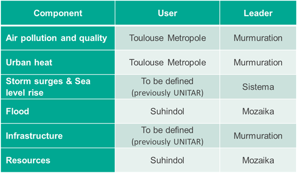
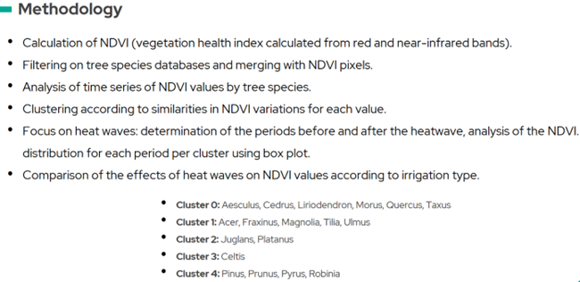
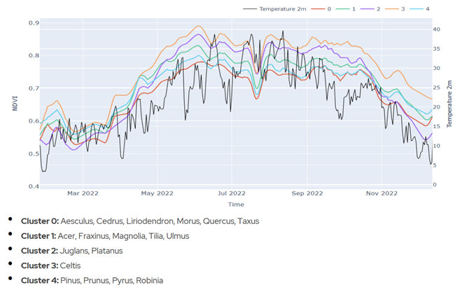
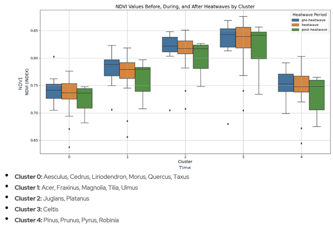

**REVISION HISTORY**

<table>
<colgroup>
<col style="width: 14%" />
<col style="width: 20%" />
<col style="width: 22%" />
<col style="width: 41%" />
</colgroup>
<thead>
<tr>
<th style="text-align: center;">Revision</th>
<th style="text-align: center;">Date</th>
<th style="text-align: center;">Author(s)</th>
<th style="text-align: center;">Description</th>
</tr>
</thead>
<tbody>
<tr>
<td>1.0</td>
<td>8/12/2023</td>
<td>Murmuration</td>
<td style="text-align: left;">First release at M1</td>
</tr>
<tr>
<td>1.1</td>
<td>21/02/2024</td>
<td>Murmuration</td>
<td style="text-align: left;">Release for RR1</td>
</tr>
<tr>
<td>1.2</td>
<td>22/05/2024</td>
<td>Murmuration</td>
<td style="text-align: left;">Release for RR2</td>
</tr>
<tr>
<td>1.3</td>
<td>20/09/2024</td>
<td>Murmuration</td>
<td style="text-align: left;">Release for RR3</td>
</tr>
<tr>
<td>1.4</td>
<td>04/10/2024</td>
<td>Murmuration</td>
<td style="text-align: left;">Release after comments from RR3</td>
</tr>
<tr>
<td></td>
<td></td>
<td></td>
<td style="text-align: left;"></td>
</tr>
<tr>
<td></td>
<td></td>
<td></td>
<td style="text-align: left;"></td>
</tr>
</tbody>
</table>

# Contents

[1 Purpose of the document
[3](#purpose-of-the-document)](#purpose-of-the-document)

[2 General Methodology [3](#general-methodology)](#general-methodology)

[3 Air pollution and quality
[4](#air-pollution-and-quality)](#air-pollution-and-quality)

[3.1 User needs [4](#user-needs)](#user-needs)

[3.2 User stories [5](#user-stories)](#user-stories)

[3.3 High-level technical tasks
[5](#high-level-technical-tasks)](#high-level-technical-tasks)

[4 Urban Heat [6](#urban-heat)](#urban-heat)

[4.1 User needs [6](#user-needs-1)](#user-needs-1)

[4.2 User stories [8](#user-stories-1)](#user-stories-1)

[4.3 High-level technical tasks
[9](#high-level-technical-tasks-1)](#high-level-technical-tasks-1)

[4.4 Extending the urban heat topic to urban vegetation monitoring
[9](#extending-the-urban-heat-topic-to-urban-vegetation-monitoring)](#extending-the-urban-heat-topic-to-urban-vegetation-monitoring)

# Purpose of the document

This document presents the Software Requirement Specification for the
Destination Earth Use Case (DEUC) UrbanSquare.

It synthesises the information gathered from the involved end-users for
the 7 components constituting UrbanSquare, the analysis made by the
UrbanSquare team and the high-level technical tasks that are derived to
drive the components implementation.

# General Methodology

The “End-user engagement - Requirement consolidation” phase aims to
clarify and detail user requirements in relation to the themes that have
been identified for each component.

The following table recap the different components and the associated
end-users.

*Figure 7: Users involved in the components implementation*

The present document covers the Software Requirement Specifications for
the “Air pollution and quality” and “Urban heat” components. This is the
first batch of components to be delivered at M3. For these components a
workshop was held on November 4th between the Murmuration
team and Guillaume Dumas, in charge of the climate service at the
“Toulouse Métropole”. A set of user needs has been collected, that will
be refined into user stories and technical tasks.

The other components will follow the same process in the coming weeks
and will be covered in separated documents.

# Air pollution and quality

## User needs

<table>
<colgroup>
<col style="width: 6%" />
<col style="width: 22%" />
<col style="width: 71%" />
</colgroup>
<thead>
<tr>
<th>ID</th>
<th style="text-align: center;">User need</th>
<th style="text-align: center;">Rationale</th>
</tr>
</thead>
<tbody>
<tr>
<td>UN-AQ1</td>
<td>Access to near-real-time (1 to 3 days lead time) air quality data at
the neighbourhood level (500m to 1km spatial resolution) for all the
urban area</td>
<td>Currently, the regional agency ATMO provides air quality data based
on in situ sensors and propagation modelling to map all of the city's
urban areas, however the data is not provided on a near-real-time
basis.</td>
</tr>
<tr>
<td>UN-AQ2</td>
<td>Assess the influence of the wind on the air quality</td>
<td>
Influence of the wind: does the wind displace the city's
pollution in certain specific areas of the city? depending on the
north-westerly wind, the autan wind, etc...

It would also be valuable to identify areas of persistence, where the
concentration remains high whatever happens, and/or areas of temporal
overexposure.
</td>
</tr>
<tr>
<td>UN-AQ3</td>
<td>Draw up an air quality profile based on weather conditions</td>
<td>
Daniel Joly's research showed the different weather typologies
that exist (in Toulouse, there are 11 different weather typologies) and
the different weather zones (8 zones in France) according to the
occurrences of these weather typologies.

As air quality is highly influenced by weather conditions (wind,
pressure, temperatures...) it would be valuable to study the links
between air quality and these weather typologies.
</td>
</tr>
<tr>
<td>UN-AQ4</td>
<td>Provide information on the factor driving the air quality model
predictions</td>
<td>The model uses different inputs to provide a 1-km air pollution map.
It would be useful to visualise what are the main factors influencing
the result provided by the model.</td>
</tr>
<tr>
<td>UN-AQ5</td>
<td>Simulate scenarios to assess the impact of climate change and local
policies</td>
<td>
The tool should provide the capability to simulate specific
scenarios in order to assess the impact of policies that would be
implemented by local authorities. Policies can be for instance
transforming roads into walking/bicycle street, deploying a Low Emission
Zone (limited traffic and vehicles speed) or increasing/decreasing the
population density in an area.

It would also be useful to be able to simulate what would be the
long-term average impact of climate change (higher temperature, change
in precipitation frequency...).
</td>
</tr>
</tbody>
</table>

## User stories

<table>
<colgroup>
<col style="width: 16%" />
<col style="width: 17%" />
<col style="width: 65%" />
</colgroup>
<thead>
<tr>
<th style="text-align: left;">User need ID</th>
<th style="text-align: center;">User story ID</th>
<th style="text-align: center;">User story</th>
</tr>
</thead>
<tbody>
<tr>
<td rowspan="5" style="text-align: left;">UN-AQ1</td>
<td style="text-align: left;">US-AQ1.1</td>
<td>As a user,  I want to visualise interactive maps of
neighbourhood-level air quality with a spatial resolution between 500m
and 1km to better understand variations in different parts of the
city.</td>
</tr>
<tr>
<td style="text-align: left;">US-AQ1.2</td>
<td>As a user, I want the ability to download neighbourhood-level air
quality data for personal use or for in-depth analysis.</td>
</tr>
<tr>
<td style="text-align: left;">US-AQ1.3</td>
<td>As a user, I want a user-friendly interface that enables the
selection of various historical timeframes, allowing me to compute
indicators over specific time ranges (average, number of days exceeding
WHO threshold).</td>
</tr>
<tr>
<td style="text-align: left;">US-AQ1.4</td>
<td>As a user, I would like to retrieve time series data for a
particular pixel on the map.</td>
</tr>
<tr>
<td style="text-align: left;">US-AQ1.5</td>
<td>As a user, I would like to retrieve time series for a group of
pixels on the map.</td>
</tr>
<tr>
<td style="text-align: left;">UN-AQ4</td>
<td style="text-align: left;">US-AQ4.1</td>
<td>As a user, I want to be able to visualise for a given neighbourhood
area the influential factor of air pollution, as an ordered list of
factors from the most influential to the least influential.</td>
</tr>
<tr>
<td style="text-align: left;">UN-AQ5</td>
<td style="text-align: left;">US-AQ5.1</td>
<td>
As a user I want to be able to simulate different scenarios by
modifying the input variables of the 1-km model and visualising the
output of the simulation on the map.

As a user, I want to be able to modify:

<ul>
<li>
meteorological conditions: air temperature, wind and
precipitations
</li>
<li>
network density: decrease the density to simulate the conversion
of roads to walking street
</li>
<li>
the traffic tendency, to simulate the drop of traffic of a
LEZ
</li>
<li>
population density
</li>
</ul></td>
</tr>
<tr>
<td style="text-align: left;">UN-AQ6</td>
<td style="text-align: left;">US-AQ6.1</td>
<td>As a user, I want to be able to choose air quality standards based
on either WHO thresholds or country-specific thresholds (ANSES in
France), so that I can monitor air quality according to my preferred
guidelines.</td>
</tr>
</tbody>
</table>

## High-level technical tasks

<table>
<colgroup>
<col style="width: 16%" />
<col style="width: 17%" />
<col style="width: 65%" />
</colgroup>
<thead>
<tr>
<th style="text-align: left;">User story ID</th>
<th style="text-align: center;">Technical task ID</th>
<th style="text-align: center;">Technical task</th>
</tr>
</thead>
<tbody>
<tr>
<td style="text-align: left;">US-AQ1.1</td>
<td style="text-align: left;">TT-AQ1.1</td>
<td style="text-align: left;">Check that the model runs on prefect</td>
</tr>
<tr>
<td style="text-align: left;">US-AQ1.1</td>
<td style="text-align: left;">TT-AQ1.2</td>
<td style="text-align: left;">Run prefect flow of 1km prediction on
Toulouse</td>
</tr>
<tr>
<td style="text-align: left;">US-AQ1.3</td>
<td style="text-align: left;">TT-AQ1.3</td>
<td style="text-align: left;">Instantiate and customise the Dash
dashboard</td>
</tr>
<tr>
<td style="text-align: left;">
US-AQ1.2

US-AQ1.3

US-AQ1.4

US-AQ1.5
</td>
<td style="text-align: left;">TT-AQ1.4</td>
<td style="text-align: left;">Implement callbacks for pixel retrieval
and download actions</td>
</tr>
<tr>
<td rowspan="2" style="text-align: left;">US-AQ4.1</td>
<td style="text-align: left;">TT-AQ4.1</td>
<td style="text-align: left;">Integrate the SHAP explainability analysis
as a callback action</td>
</tr>
<tr>
<td style="text-align: left;">TT-AQ4.2</td>
<td style="text-align: left;">Implement SHAP result visualisation into
the dash Dashboard</td>
</tr>
<tr>
<td style="text-align: left;">US-AQ5.1</td>
<td style="text-align: left;">TT-AQ5.1</td>
<td style="text-align: left;">Implement the capacity to provide
simulation inputs to the model: different traffic tendency, different
meteorological conditions (air temperature and wind), different road
density.</td>
</tr>
<tr>
<td style="text-align: left;">US-AQ5.1</td>
<td style="text-align: left;">TT-AQ5.2</td>
<td style="text-align: left;">In the GUI, implement a dropdown menu for
the road traffic tendency</td>
</tr>
<tr>
<td style="text-align: left;">US-AQ5.1</td>
<td style="text-align: left;">TT-AQ5.3</td>
<td style="text-align: left;">In the GUI, implement a dropdown menu for
the air temperature</td>
</tr>
<tr>
<td style="text-align: left;">US-AQ5.1</td>
<td style="text-align: left;">TT-AQ5.4</td>
<td style="text-align: left;">In the GUI, implement a dropdown menu for
the wind conditions</td>
</tr>
<tr>
<td style="text-align: left;">US-AQ5.1</td>
<td style="text-align: left;">TT-AQ5.5</td>
<td style="text-align: left;">In the GUI, implement a dropdown menu for
road network density</td>
</tr>
<tr>
<td style="text-align: left;">US-AQ6.1</td>
<td style="text-align: left;">TT-AQ6.1</td>
<td style="text-align: left;">Implement a dropdown menu in the air
quality settings that allows users to select between WHO, ANSES and
other pre-saved air quality guidelines.</td>
</tr>
</tbody>
</table>

# Urban Heat

## User needs

<table>
<colgroup>
<col style="width: 6%" />
<col style="width: 22%" />
<col style="width: 71%" />
</colgroup>
<thead>
<tr>
<th>ID</th>
<th style="text-align: center;">User need</th>
<th style="text-align: center;">Rationale</th>
</tr>
</thead>
<tbody>
<tr>
<td>UN-UH1</td>
<td>Perform a before/after analysis to assess the efficiency of public
policies in priority neighbourhoods (major programme of renovation work
on buildings)</td>
<td>
Analysing the buildings at a neighbourhood scale enables
assessing their energy performance before and after a renovation
programme. It would be a valuable indicator to justify the usefulness of
public aid and policies.

This can be applied

<ul>
<li>
to residential private co-owned buildings benefiting from public
renovation aid
</li>
<li>
to big public renovation programmes on commercial/industrial
areas.
</li>
</ul>

Example: the neighbourhood of “Empalot” in Toulouse, which has
benefited from many renovation programmes in the last 30 years.

The energy efficiency of a building can be assessed in winter by
detecting the house-heating energy loss. The assumption can be made that
poorly isolated buildings in winter will also suffer from urban heat in
summer.

The analysis can be made based on LST and albedo
measurements.
</td>
</tr>
<tr>
<td>UN-UH2</td>
<td>Identify the type of urban vegetation (tree species) and its health
to quantify its contribution to urban heat mitigation</td>
<td>
The “Toulouse Metropole '' platform IADATA provides heat island
mapping. It computes a cooling potential index (IPR for “indice de
potentiel de rafraîchissement'' in French) at a 0,5m spatial
resolution.

The IPR computation includes:

<ul>
<li>
weather conditions
</li>
<li>
register of building materials and floor coverings
</li>
<li>
modelling of the building and vegetation drop shadow
</li>
<li>
modelling of the vegetation evapotranspiration (different
according to the time of day)
</li>
</ul>

Current limitations include:

<ul>
<li>
vegetation supposed to be "functioning" / identical vegetation:
no differentiation between low vegetation, high vegetation, type of
foliage, development, type of tree…
</li>
<li>
no consideration for the health of vegetation
</li>
</ul>

Toulouse metropole has some LIDAR products for specific dates,
although there is no register with georeferenced data of all the tree
species in the city (e.g. how many oaks in the city?), nor tree health
diagnostic for the past year.

HR data (Planet) can be exploited, with LIDAR data used as a
validation product.

Toulouse Metropole has a database of all the trees in the area,
geolocated and classified by species. They would be very interested in
cross-referencing the information in this database with precise
monitoring data on vegetation health (at tree level) and meteorology in
order to assess the response of different species to water and heat
stress. The aim is to identify the species best adapted locally to
current and future conditions (based on climate projection
scenarios).
</td>
</tr>
<tr>
<td>UN-UH3</td>
<td>
Characterise the contribution of different crop varieties to the
cooling effect of the urban area.

Measure the effects of urban sprawl on agricultural areas
(agricultural nibbling) and quantify the associated negative effect on
urban heat.
</td>
<td>
The Toulouse administrative area includes an agricultural belt
surrounding the city.

Many challenges are faced with these peri-urban agricultural
areas:

<ul>
<li>
Comply with the ZAN (zero net artificialisation) policy at the
city level
</li>
<li>
Currently there is no assessment of the impact of land
artificialisation in these areas on the city’s urban heat
islands
</li>
</ul>

It would be very valuable to assess which crop brings the most heat
or, on the contrary, the most cooling effect to the urban area as a
whole.
</td>
</tr>
<tr>
<td>UN-UH4</td>
<td>Provide projection scenario to assess the impact of future heat
waves on urban heat islands</td>
<td>Climate change is expected to have a strong impact on the Toulouse
region. Heat waves have become more frequent in recent years and this
trend will continue. It would be useful to have a tool able to simulate
projection scenarios of heat waves, and their impact on local urban
temperature.</td>
</tr>
</tbody>
</table>

## User stories

<table>
<colgroup>
<col style="width: 16%" />
<col style="width: 17%" />
<col style="width: 65%" />
</colgroup>
<thead>
<tr>
<th>User need ID</th>
<th style="text-align: center;">User story ID</th>
<th style="text-align: center;">User story</th>
</tr>
</thead>
<tbody>
<tr>
<td>UN-UH1</td>
<td>US-UH1</td>
<td>
As an urban climate analyst,

I want a tool that allows me to analyse and visualise the changes in
thermal conditions within a specific neighbourhood or defined urban area
over time and then enables me to compare these conditions between
different neighbourhoods or areas,

So that I can assess and understand the impact of environmental
factors, urban development, and policy changes on local climates and
evaluate the effectiveness of various urban designs and policies in
managing these climates across the city.
</td>
</tr>
<tr>
<td>UN-UH2</td>
<td>US-UH2</td>
<td>
As a urban planner,

I want a tool that allows me to extend the capacity of my tree
species geolocated database by providing an analysis of the response of
different tree species to the heat waves,

So that I can identify the species that I can plant now and that will
be the most resistant in the decades to come (50 to 100 years)
</td>
</tr>
<tr>
<td>UN-UH4</td>
<td>US-UH4</td>
<td>
As an urban climate analyst,

I want a tool that can simulate heat waves scenarios in the
future

So that I can assess the urban heat island intensity in the coming
decades
</td>
</tr>
</tbody>
</table>

## High-level technical tasks

<table>
<colgroup>
<col style="width: 16%" />
<col style="width: 17%" />
<col style="width: 65%" />
</colgroup>
<thead>
<tr>
<th style="text-align: left;">User story ID</th>
<th style="text-align: center;">Technical task ID</th>
<th style="text-align: center;">Technical task</th>
</tr>
</thead>
<tbody>
<tr>
<td rowspan="6" style="text-align: left;">US-UH1</td>
<td style="text-align: left;">TT-UH1.1</td>
<td>Gather and prepare AOI</td>
</tr>
<tr>
<td style="text-align: left;">TT-UH1.2</td>
<td>Download Required data</td>
</tr>
<tr>
<td style="text-align: left;">TT-UH1.3</td>
<td>Process TIRS Landsat images to LST</td>
</tr>
<tr>
<td style="text-align: left;">TT-UH1.4</td>
<td>Combine data &amp; Compute Urban Heat products</td>
</tr>
<tr>
<td style="text-align: left;">TT-UH1.5</td>
<td>Design Dashboard and implement data</td>
</tr>
<tr>
<td style="text-align: left;">TT-UH1.6</td>
<td>Automatize the process</td>
</tr>
<tr>
<td rowspan="7" style="text-align: left;">US-UH2</td>
<td style="text-align: left;">TT-UH2.1</td>
<td>Extract Planet data over the two test areas in Toulouse</td>
</tr>
<tr>
<td style="text-align: left;">TT-UH2.2</td>
<td>Calculate NDVI from Planet data</td>
</tr>
<tr>
<td style="text-align: left;">TT-UH2.3</td>
<td>Filtering on tree species databases and merging with NDVI
pixels</td>
</tr>
<tr>
<td style="text-align: left;">TT-UH2.4</td>
<td>Clustering of tree species according to similarities in NDVI
variations for each value</td>
</tr>
<tr>
<td style="text-align: left;">TT-UH2.5</td>
<td>Determination of the periods before and after the heatwave, analysis
of the NDVI. Distribution for each period per cluster using box
plot.</td>
</tr>
<tr>
<td style="text-align: left;">TT-UH2.6</td>
<td>Comparison of the effects of heat waves on NDVI values according to
irrigation type</td>
</tr>
<tr>
<td style="text-align: left;">TT-UH2.7</td>
<td>Development of a dashboard to report the results</td>
</tr>
<tr>
<td rowspan="6" style="text-align: left;">US-UH4</td>
<td style="text-align: left;">TT-UH4.1</td>
<td>Extract projection data from DestinE Climate Change DT</td>
</tr>
<tr>
<td style="text-align: left;">TT-UH4.2</td>
<td>Extract historical data on air temperature (ERA5) and land surface
temperature (Landsat)</td>
</tr>
<tr>
<td style="text-align: left;">TT-UH4.3</td>
<td>Model the relation between air temperature projection and urban heat
islands using pixel-wise linear regression</td>
</tr>
<tr>
<td style="text-align: left;">TT-UH4.4</td>
<td>Implement pixel-wise linear regression to compute LST projections
for each pixel based on selected air temperatures (30°C, 35°C, 40°C,
45°C)</td>
</tr>
<tr>
<td style="text-align: left;">TT-UH4.5</td>
<td>Calculate the average annual number of days where temperatures meet
or exceed 30°C, 35°C, 40°C, and 45°C for each SSP scenario</td>
</tr>
<tr>
<td style="text-align: left;">TT-UH4.6</td>
<td>Dashboard modification : Add dropdowns for selecting air
temperatures (30°C, 35°C, 40°C, 45°C), and year. Enhance the map to
display LST projections based on selections. Use bar charts to compare
the number of days temperatures exceed thresholds across SSP scenarios
and years.</td>
</tr>
</tbody>
</table>

## Extending the urban heat topic to urban vegetation monitoring

Monitoring urban vegetation is becoming increasingly important as cities
become denser and the climate change accelerates. Urban vegetation plays
a key role in regulating environmental conditions and mitigating the
urban heat island.

Satellite observation enables daily fine-scale monitoring, with the
ability to differentiate at the tree level using high spatial and
temporal resolution multispectral data (3 meters and daily revisit with
Planet data). This allows for the calculation of indices such as density
and health (NDVI) and humidity (NDWI). Assessments can be conducted
before, during, and after heatwaves and droughts, precisely quantifying
vegetation response to stress.

By combining this observation with local geolocated databases on tree
species (provided by Toulouse Metropole in the case of the pilot
application) and meteorological data (rainfall, air temperature from
ERA5 ECWMF data), the response of each species can be evaluated, and the
most resilient species can be identified. On this basis, scenarios can
be built based on climatic projections to plan and adapt the urban
vegetation to the present and future climate conditions.

Satellite observation can significantly enhance watering management by
pinpointing the optimal periods for irrigation—before, during, and after
heatwaves—and identifying the specific watering needs of each species.  
  
Cloud based services, existing satellite data dissemination platform,
and innovative pixel scale business model for the data acquisition
enable the provision of operational satellite-based services at an
affordable cost for cities.

The solution is co-designed with Toulouse municipality. Initial results
were obtained in June 2024 showing vegetation health before and after
heat waves, identifying resistant species, and demonstrating the impact
of watering on an irrigated area. This is summed up in the following
figures, with first the general methodology and then the results
obtained on two test areas in Toulouse.

<figure>

<figcaption>
: Methodology to assess the response to heat wave of
different tree species
</figcaption>
</figure>

<figure>

<figcaption>
: Response to heat waves of different tree species in 2
test area in Toulouse – Raw evolution of the NDVI over
time.
</figcaption>
</figure>

<figure>

<figcaption>
: Response to heat waves of different tree species in 2
test area in Toulouse – Assessment of the NDVI evolution before, during
and after heat waves
</figcaption>
</figure>

Here are the first findings:

1.  The different categories of trees have very different dynamics
    regarding their response to climate stress: In some cases immediate
    health decline at the onset of a heatwave, or resilience despite the
    stress, in other cases quick recovery after a heatwave or prolonged
    deterioration that prevents a return to initial health levels

2.  Outliers lower the distribution during the post-heatwave period:
    within a species, certain trees are more severely affected, likely
    due to factors such as location (isolation, soil type, etc.)

3.  Non-irrigated trees appear to be more resilient than irrigated ones
    during a heatwave, indicating that irrigation during this period is
    not effective. However, irrigating after the heatwave promotes
    better vegetation recovery.

Satellite-based urban vegetation monitoring is innovative as it provides
real-time, large-scale data for precise tracking of vegetation health
and changes, enabling informed decision-making for urban planning and
climate resilience, surpassing the capabilities of traditional
ground-based methods.

The service for Toulouse, addressing common urban issues, is easily
replicable in other cities with a geolocated tree species register.
Based on affordable data and scalable data access & processing resources
thanks to the Destination Earth platform, it will offer an online
dashboard with automatic setup for new areas, reducing costs and
enabling broad scalability and impact.

