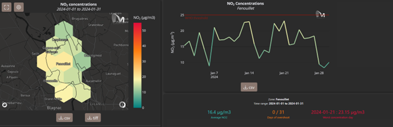
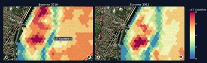

**REVISION HISTORY**

<table>
<colgroup>
<col style="width: 14%" />
<col style="width: 20%" />
<col style="width: 22%" />
<col style="width: 41%" />
</colgroup>
<thead>
<tr>
<th style="text-align: center;">Revision</th>
<th style="text-align: center;">Date</th>
<th style="text-align: center;">Author(s)</th>
<th style="text-align: center;">Description</th>
</tr>
</thead>
<tbody>
<tr>
<td>1.0</td>
<td>05/05/2025</td>
<td>Murmuration, Sistema, Mozaika</td>
<td style="text-align: left;">Initial version</td>
</tr>
<tr>
<td>1.1</td>
<td>20/06/2025</td>
<td>Murmuration, Sistema, Mozaika</td>
<td style="text-align: left;">Update after review by Starion.</td>
</tr>
</tbody>
</table>

# Contents

[1 Context [3](#context)](#context)

[2 User needs [5](#user-needs)](#user-needs)

[2.1 Air quality [5](#air-quality)](#air-quality)

[2.2 Urban heat [6](#urban-heat)](#urban-heat)

[2.3 Sea level rise and storm surges
[8](#sea-level-rise-and-storm-surges)](#sea-level-rise-and-storm-surges)

[2.4 Flood [9](#flood)](#flood)

[2.5 Infrastructure [10](#infrastructure)](#infrastructure)

[2.6 Resources [10](#resources)](#resources)

[3 Test results & findings
[12](#test-results-findings)](#test-results-findings)

[3.1 Air quality [12](#air-quality-1)](#air-quality-1)

[3.2 Urban heat [14](#urban-heat-1)](#urban-heat-1)

[3.3 Sea level rise and storm surges
[16](#sea-level-rise-and-storm-surges-1)](#sea-level-rise-and-storm-surges-1)

[3.4 Flood [18](#flood-1)](#flood-1)

[3.5 Infrastructure [20](#infrastructure-1)](#infrastructure-1)

[3.6 Resources [20](#resources-1)](#resources-1)

[4 Conclusion [22](#conclusion)](#conclusion)

# Context

The goal of UrbanSquare is to provide operational tools to urban
planners, enabling them to assess the exposure of their territory and
plan to adapt to these risks. For that monitoring capacities are
provided to understand the historical and current situation as well as
projection capacities to plan future actions.

UrbanSquare is organised along six components, summed up in the
following table.

*Table 1: UrbanSquare components*

<table>
<colgroup>
<col style="width: 29%" />
<col style="width: 52%" />
<col style="width: 18%" />
</colgroup>
<thead>
<tr>
<th>Component</th>
<th>Description</th>
<th>Leader</th>
</tr>
</thead>
<tbody>
<tr>
<td>Air quality</td>
<td>Past and present view of the air pollution in a territory and
comparison to the WHO standards</td>
<td>Murmuration</td>
</tr>
<tr>
<td>Urban heat</td>
<td>Heat exposure indicator allowing the identification of heat islands
on the area of interest, mapped on land use and urban vegetation</td>
<td>Murmuration</td>
</tr>
<tr>
<td>Sea level rise and storm surges</td>
<td>Exploitation of climate scenarios up to 2150 to assess potential
inundation risk and effects due to sea level rise in the coastal
areas</td>
<td>Sistema</td>
</tr>
<tr>
<td>Flood</td>
<td>Environment for forecasting the flood risk in a territory over a
period of 1 year from the initial conditions</td>
<td>Mozaika</td>
</tr>
<tr>
<td>Infrastructure</td>
<td>Updated map of the road infrastructure highlighting the areas that
would need action or restoration</td>
<td>Murmuration</td>
</tr>
<tr>
<td>Resources</td>
<td>Integrated socio-economic data to quantify the potential impacts of
a climate risk on the area of interest</td>
<td>Mozaika</td>
</tr>
</tbody>
</table>

End users are involved to accompany the developments of UrbanSquare.

- **Toulouse Metropole (France):** the city of Toulouse has been active
  in implementing solution to combat urban risks, in particular related
  to extreme heat waves and air pollution. Led by researchers from the
  French National Scientific Research Centre (CNRS), this team (the city
  and the CNRS) has contributed to the co-design of the extreme heat
  events and air pollution components.

- **Municipality of Suhindol (Bulgaria):** the municipality is keen on
  understanding the potential impact of climate change induced risks on
  its population. The team supports UrbanSquare regarding the potential
  flooding events and the population dynamic pressure on the available
  resources.

- **UNESCO:** the UNESCO Chair on Intersectoral Safety for Disaster Risk
  Reduction and Resilience (University of Udine, Italy) was contacted.
  Professor Stefano Grimaz and Dr Petra Malisan have been involved in
  the evaluation of the “Sea level rise and storm surges” component.

- **TUHH**: Additional feedback was received from Dr. Natasa Manojlovic
  from the Institute of River and Coastal Engineering at Hamburg
  University of Technology (TUHH), who was interested in seeing the
  results of the SLR service over the island of Newark (Germany).

- Rasmus Reeh, an urban consultant with experience in multiple projects
  for the **Municipality of Copenhagen**, contributed to the
  Infrastructure component. The service was presented to him, and direct
  feedback was gathered. However, due to the tight schedule and the fact
  that this activity took place at the end of the project, it was not
  possible to obtain more formalized feedback.

These end users and their involvement are summed up in the following
table.

*Table 2: Users involved in the components implementation*

<table>
<colgroup>
<col style="width: 51%" />
<col style="width: 48%" />
</colgroup>
<thead>
<tr>
<th style="text-align: center;">Component</th>
<th style="text-align: center;">User</th>
</tr>
</thead>
<tbody>
<tr>
<td style="text-align: center;">Air pollution and quality</td>
<td style="text-align: center;">Toulouse Metropole</td>
</tr>
<tr>
<td style="text-align: center;">Urban heat</td>
<td style="text-align: center;">Toulouse Metropole</td>
</tr>
<tr>
<td style="text-align: center;">Sea level rise and storm surges</td>
<td style="text-align: center;">UNESCO, TUHH</td>
</tr>
<tr>
<td style="text-align: center;">Flood</td>
<td style="text-align: center;">Suhindol Municipality</td>
</tr>
<tr>
<td style="text-align: center;">Infrastructure</td>
<td style="text-align: center;">Rasmus Reeh (Urban consultant for
Copenhagen Municipality)</td>
</tr>
<tr>
<td style="text-align: center;">Resources</td>
<td style="text-align: center;">Suhindol Municipality</td>
</tr>
</tbody>
</table>

# User needs

User needs have been collected in the first phase of the project and
reported into the deliverables “SRS1 - Software Requirement
Specification for Air Quality and Urban Heat components”, “SRS2 -
Software Requirement Specification for Flood, Storm and Sea Level Rise
components” and “SRS3 - Software Requirement Specification for
Infrastructure and Resources components”. A recap of these needs is
presented in the following tables.

## Air quality

<table>
<colgroup>
<col style="width: 6%" />
<col style="width: 22%" />
<col style="width: 71%" />
</colgroup>
<thead>
<tr>
<th>ID</th>
<th style="text-align: center;">User need</th>
<th style="text-align: center;">Rationale</th>
</tr>
</thead>
<tbody>
<tr>
<td>UN-AQ1</td>
<td>Access to near-real-time (1 to 3 days lead time) air quality data at
the neighbourhood level (500m to 1km spatial resolution) for all the
urban area</td>
<td>Currently, the regional agency ATMO provides air quality data based
on in situ sensors and propagation modelling to map all of the city's
urban areas, however the data is not provided on a near-real-time
basis.</td>
</tr>
<tr>
<td>UN-AQ2</td>
<td>Assess the influence of the wind on the air quality</td>
<td>
Influence of the wind: does the wind displace the city's
pollution in certain specific areas of the city? depending on the
north-westerly wind, the autan wind, etc...

It would also be valuable to identify areas of persistence, where the
concentration remains high whatever happens, and/or areas of temporal
overexposure.
</td>
</tr>
<tr>
<td>UN-AQ3</td>
<td>Draw up an air quality profile based on weather conditions</td>
<td>
Daniel Joly's research showed the different weather typologies
that exist (in Toulouse, there are 11 different weather typologies) and
the different weather zones (8 zones in France) according to the
occurrences of these weather typologies.

As air quality is highly influenced by weather conditions (wind,
pressure, temperatures...) it would be valuable to study the links
between air quality and these weather typologies.
</td>
</tr>
<tr>
<td>UN-AQ4</td>
<td>Provide information on the factor driving the air quality model
predictions</td>
<td>The model uses different inputs to provide a 1-km air pollution map.
It would be useful to visualise what are the main factors influencing
the result provided by the model.</td>
</tr>
<tr>
<td>UN-AQ5</td>
<td>Simulate scenarios to assess the impact of climate change and local
policies</td>
<td>
The tool should provide the capability to simulate specific
scenarios in order to assess the impact of policies that would be
implemented by local authorities. Policies can be for instance
transforming roads into walking/bicycle street, deploying a Low Emission
Zone (limited traffic and vehicles speed) or increasing/decreasing the
population density in an area.

It would also be useful to be able to simulate what would be the
long-term average impact of climate change (higher temperature, change
in precipitation frequency...).
</td>
</tr>
<tr>
<td>UN-AQ6</td>
<td>Adapt the air quality standard</td>
<td>The air quality standard that is applied in the graph and in the
calculation of “polluted days” should be configurable. The WHO
threshold, while valuable as an international standard, is not the
regulation in force in France (it should be the guidelines from ANSES).
It would be interesting to be able to switch from a standard to another
to fit with different usage (communication, comparison with other
cities, official publications…).</td>
</tr>
</tbody>
</table>

## Urban heat

<table>
<colgroup>
<col style="width: 6%" />
<col style="width: 22%" />
<col style="width: 71%" />
</colgroup>
<thead>
<tr>
<th>ID</th>
<th style="text-align: center;">User need</th>
<th style="text-align: center;">Rationale</th>
</tr>
</thead>
<tbody>
<tr>
<td>UN-UH1</td>
<td>Perform a before/after analysis to assess the efficiency of public
policies in priority neighbourhoods (major programme of renovation work
on buildings)</td>
<td>
Analysing the buildings at a neighbourhood scale enables
assessing their energy performance before and after a renovation
programme. It would be a valuable indicator to justify the usefulness of
public aid and policies.

This can be applied

<ul>
<li>
to residential private co-owned buildings benefiting from public
renovation aid
</li>
<li>
to big public renovation programmes on commercial/industrial
areas.
</li>
</ul>

Example: the neighbourhood of “Empalot” in Toulouse, which has
benefited from many renovation programmes in the last 30 years.

The energy efficiency of a building can be assessed in winter by
detecting the house-heating energy loss. The assumption can be made that
poorly isolated buildings in winter will also suffer from urban heat in
summer.

The analysis can be made based on LST and albedo
measurements.
</td>
</tr>
<tr>
<td>UN-UH2</td>
<td>Identify the type of urban vegetation (tree species) and its health
to quantify its contribution to urban heat mitigation</td>
<td>
The “Toulouse Metropole '' platform IADATA provides heat island
mapping. It computes a cooling potential index (IPR for “indice de
potentiel de rafraîchissement'' in French) at a 0,5m spatial
resolution.

The IPR computation includes:

<ul>
<li>
weather conditions
</li>
<li>
register of building materials and floor coverings
</li>
<li>
modelling of the building and vegetation drop shadow
</li>
<li>
modelling of the vegetation evapotranspiration (different
according to the time of day)
</li>
</ul>

Current limitations include:

<blockquote>

vegetation supposed to be "functioning" / identical vegetation: no
differentiation between low vegetation, high vegetation, type of
foliage, development, type of tree…

no consideration for the health of vegetation

</blockquote>

Toulouse metropole has some LIDAR products for specific dates,
although there is no register with georeferenced data of all the tree
species in the city (e.g. how many oaks in the city?), nor tree health
diagnostic for the past year.

HR data (Planet) can be exploited, with LIDAR data used as a
validation product.

Toulouse Metropole has a database of all the trees in the area,
geolocated and classified by species. They would be very interested in
cross-referencing the information in this database with precise
monitoring data on vegetation health (at tree level) and meteorology in
order to assess the response of different species to water and heat
stress. The aim is to identify the species best adapted locally to
current and future conditions (based on climate projection
scenarios).
</td>
</tr>
<tr>
<td>UN-UH3</td>
<td>
Characterise the contribution of different crop varieties to the
cooling effect of the urban area.

Measure the effects of urban sprawl on agricultural areas
(agricultural nibbling) and quantify the associated negative effect on
urban heat.
</td>
<td>
The Toulouse administrative area includes an agricultural belt
surrounding the city.

Many challenges are faced with these peri-urban agricultural
areas:

<ul>
<li>
Comply with the ZAN (zero net artificialisation) policy at the
city level
</li>
<li>
Currently there is no assessment of the impact of land
artificialisation in these areas on the city’s urban heat
islands
</li>
</ul>

It would be very valuable to assess which crop brings the most heat
or, on the contrary, the most cooling effect to the urban area as a
whole.
</td>
</tr>
<tr>
<td>UN-UH4</td>
<td>Provide projection scenario to assess the impact of future heat
waves on urban heat islands</td>
<td>Climate change is expected to have a strong impact on the Toulouse
region. Heat waves have become more frequent in recent years and this
trend will continue. It would be useful to have a tool able to simulate
projection scenarios of heat waves, and their impact on local urban
temperature.</td>
</tr>
</tbody>
</table>

##  Sea level rise and storm surges

<table>
<colgroup>
<col style="width: 16%" />
<col style="width: 20%" />
<col style="width: 63%" />
</colgroup>
<thead>
<tr>
<th>ID</th>
<th style="text-align: center;">User need</th>
<th style="text-align: center;">Rationale</th>
</tr>
</thead>
<tbody>
<tr>
<td>UN-RES-1</td>
<td>Ability to access the inundation product and select parameters</td>
<td>
The sea level rise and storm surges component is expected to
produce high resolution inundation scenario products for any area of the
globe in a quick and user-friendly manner, so that it can be used by
municipalities and entities as a supporting tool to work towards a
comprehensive emergency protocol to follow in case of inundation in
coastal areas, in order to protect the population, the economic assets
and protected natural areas. The territory can be affected by climate
change in different ways. The tool allows to produce long-term what-if
scenarios depending on three main parameters:

<ul>
<li>
Shared Socioeconomic Pathway (SSP), which is a climate scenario
of the projected global changes, used to derive greenhouse gas emissions
scenarios with different climate policies;
</li>
<li>
the model year to which the SSP projection is applied (from 2040,
up to 2150);
</li>
<li>
storm surge height, i.e. the unusual rise in seawater level
during a storm.
</li>
</ul></td>
</tr>
<tr>
<td>UN-RES-2</td>
<td>Ability to draw an area of interest and extract the relevant
assets</td>
<td>In order to better assess the inundation risk severity in the area
of interest, the platform should allow to extract the area’s amenities
such as hospitals, schools and power plants, as well as to overlay other
maps of interest related to population and land use, derived from
datasets such as Global Human Settlement and WorldCereal.</td>
</tr>
<tr>
<td>UN-RES-3</td>
<td>Ability to retrieve information regarding affected population,
buildings and crops.</td>
<td>With the aim of guiding the relevant entities and developing an
efficient emergency protocol, it is of great significance to be able to
obtain the data regarding the area of interest affected by the what-if
scenario. In particular, the estimated population affected by inundation
is expected, as well as the affected crops and buildings.</td>
</tr>
<tr>
<td>UN-RES-4</td>
<td>Ability to download relevant information</td>
<td>For reporting purposes, it would be useful to be able to download
the relevant output(s) of the inundation product (i.e. assets, flood
extent).</td>
</tr>
<tr>
<td>UN-RES-5</td>
<td>Ability to assess impact of floods on the territory’s sentinel
points</td>
<td>While assessing the extent of the impact in the urban area can be
useful, understanding the impact on sentinel points, i.e. critical
infrastructures, is of greater importance for decision making and
strategic planning. Sentinel points such as power plants are to be
highlighted: in case of inundation, the territory is not only affected
by the hazard itself but also by lack of power, which can influence
emergency response.</td>
</tr>
</tbody>
</table>

## Flood

<table>
<colgroup>
<col style="width: 15%" />
<col style="width: 15%" />
<col style="width: 68%" />
</colgroup>
<thead>
<tr>
<th>ID</th>
<th style="text-align: center;">User need</th>
<th style="text-align: center;">Rationale</th>
</tr>
</thead>
<tbody>
<tr>
<td>UN-FL-1</td>
<td>Ability to receive advanced warning for upcoming floods</td>
<td>
The municipalities have protocols of behaviour and rules for
reaction during emergency situations produced by the Ministry of
environment. They would benefit from advanced information about upcoming
flood situations because they will be able to better adapt and plan for
applying the regulatory protocols to optimally protect the population,
the real estate and the fields.

ISME-HYDRO produces forecasts about the hydrological status of rivers
for up to 30 days ahead. This is considered a very promising time period
to allow the municipality officials to prepare for the upcoming
difficult circumstance. The officials receive alerting through
ISME-HYDRO once they detect forecasted higher than normal water levels
and discharge
</td>
</tr>
<tr>
<td>UN-FL-2</td>
<td>Ability to assess the size of the flood</td>
<td>
The municipalities have the obligation to protect the population,
to minimise the damages of a flood event. That is why they would benefit
from precise and detailed information about the size of the flood.

ISME-HYDRO produces forecasts about the hydrological status of the
rivers, and provides capabilities for querying and reviewing the
hydrological data in tables, on graphs and on the map in a synchronised
manner. This gives the possibility to municipality officials to inquire
and obtain detailed information about the water levels and discharge
expected to be in place way before the event to occur, which gives a
time window for them to size and plan the protection
activities.
</td>
</tr>
<tr>
<td>UN-FL-3</td>
<td>Ability to visualise the flood span</td>
<td>
In order to better assess the expected damage of an upcoming
flood, the municipality officials have to be able to see the area that
will be affected by the high water levels. That is why they need an
accurate visualisation of the flood plains and the span of the flood
over the land in order to be able to assess the type of land or
infrastructure that will be affected.

ISME-HYDRO produces interactive flood maps based on the forecasted
hydrological features and provides the municipalities officials with the
ability to query about hydrological features in given times in the
future and obtain the flood spans visualised on the map, so that they
can view the areas under their responsibility and see the lands and
infrastructure that will be affected.
</td>
</tr>
</tbody>
</table>

## Infrastructure

<table>
<colgroup>
<col style="width: 15%" />
<col style="width: 15%" />
<col style="width: 68%" />
</colgroup>
<thead>
<tr>
<th>ID</th>
<th style="text-align: center;">User need</th>
<th style="text-align: center;">Rationale</th>
</tr>
</thead>
<tbody>
<tr>
<td>UN-INF-1</td>
<td>Classify the state of roads</td>
<td>The goal is to evaluate the road damages. The primary source of
damages that is considered is the daily wear and tear from regular
traffic combined with insufficient maintenance actions. Roads should be
classified according to the amount of damages: perfect status, slightly
damaged, severely damaged, impracticable for conventional
vehicles...</td>
</tr>
<tr>
<td>UN-INF-2</td>
<td>Continuously monitor road infrastructure</td>
<td>
The goal is to get a regularly updated map of the road
infrastructure highlighting the areas that would need action or
restoration.

The update frequency must be compliant with the operational rhythm of
the urban services responsible for road maintenance. The hypothesis of a
monthly update is considered.
</td>
</tr>
</tbody>
</table>

## Resources

<table>
<colgroup>
<col style="width: 16%" />
<col style="width: 20%" />
<col style="width: 63%" />
</colgroup>
<thead>
<tr>
<th>ID</th>
<th style="text-align: center;">User need</th>
<th style="text-align: center;">Rationale</th>
</tr>
</thead>
<tbody>
<tr>
<td>UN-RS-1</td>
<td>Ability to evaluate flood damages</td>
<td>In a flood event the municipalities officials need to see and
inspect the flooded areas and what land objects are in these flooded
areas in order to evaluate the flood damages.</td>
</tr>
<tr>
<td>UN-RS-2</td>
<td>Ability to estimate the resources needed for recovery</td>
<td>Based on the evaluation of the flooded areas the municipalities
officials need to analyse the size of the incurred damages in terms of
number of buildings, population, infrastructure, size of agricultural
land and forests affected and determine the measures and estimate the
resources needed to be undertaken for recovery</td>
</tr>
<tr>
<td>UN-RS-3</td>
<td>Ability to plan recovery</td>
<td>Based on the determination and estimation of the resources needed to
be undertaken for recovery, draw a plan for carrying out the recovery
measures.</td>
</tr>
</tbody>
</table>

# Test results & findings

## Air quality

<table>
<colgroup>
<col style="width: 4%" />
<col style="width: 18%" />
<col style="width: 38%" />
<col style="width: 38%" />
</colgroup>
<thead>
<tr>
<th>ID</th>
<th style="text-align: center;">User need</th>
<th style="text-align: center;">User Feedback Summary</th>
<th style="text-align: center;">Comments from the UrbanSquare
consortium</th>
</tr>
</thead>
<tbody>
<tr>
<td>UN-AQ1</td>
<td>Access to near-real-time (1 to 3 days lead time) air quality data at
the neighbourhood level (500m to 1km spatial resolution) for all the
urban area</td>
<td>
The high resolution mapping is very valuable. The capacity to
focus on a neighbourhood and deliver localised air quality reports (see
Figure 1) specific to each city district or partner cities in the “Grand
Toulouse” community is key to provide meaningful information to the
population.

Reports would be published every month, so for this specific use case
a daily delivery of data if not required. The important point is to get
the data with a minimal lead time (a few days) to be able to be reactive
in publishing the air quality report for the past month.
</td>
<td>Monthly updates would be sufficient for the considered usage.</td>
</tr>
<tr>
<td>UN-AQ2</td>
<td>Assess the influence of the wind on the air quality</td>
<td>The 1-km model provides information on the relation between wind
conditions and air pollution, though it does not allow to analyse how
pollution is transported from the emission sources and how the wind
affect the pollution areas.</td>
<td>The challenge of modelling urban air quality at high-resolution
while accounting for wind conditions and pollutant dispersion is an
active area of research, though not yet fully mature for operational
deployment. The plan of Murmuration to explore this topic is to engage
with research laboratories and seek for collaboration opportunities
through European program (e.g. Interreg or Horizon program) or national
(e.g. CNES R&amp;D) fundings.</td>
</tr>
<tr>
<td>UN-AQ3</td>
<td>Draw up an air quality profile based on weather conditions</td>
<td>Not addressed.</td>
<td>The topic of deriving air quality profiles based on weather
condition profiles is an active area of research<a href="#fn1"
class="footnote-ref" id="fnref1" role="doc-noteref">1</a>,
sitting at the intersection of atmospheric science, environmental
modelling, and machine learning. Just as the previous one, the topic
seems to not be mature enough for operational deployment yet and should
be addressed first through R&amp;D fundings and collaborations with
research actors.</td>
</tr>
<tr>
<td>UN-AQ4</td>
<td>Provide information on the factor driving the air quality model
predictions</td>
<td>The different factors are mentioned and ranked, which is valuable,
though the level of details could be improved.</td>
<td></td>
</tr>
<tr>
<td>UN-AQ5</td>
<td>Simulate scenarios to assess the impact of climate change and local
policies</td>
<td>
The simulation feature has a lot of potential and is the most
expected in the municipality services. The prediction related to traffic
are interesting though the 1-km resolution is not very convenient to
really understand the pollution with regards to traffic. A visualisation
with even better resolution, fitting with the main roads emitting the
pollution would be good and more impactful to decision-makers and
general public.

The impact of climate change is partially addressed though it does
not show the long-term trend.
</td>
<td>
he 1-km resolution was defined arbitrarily, but the modelling
approach is technically capable of supporting finer resolutions.
However, there's a trade-off between spatial resolution and the
reliability of validation. Since validation depends on the density and
coverage of ground-based monitoring stations, increasing the resolution
tends to reduce the robustness of validation results. Given that the
ground station networks in the cities used for validation are relatively
sparse, proposing a resolution finer than 1 km would introduce too much
uncertainty at this stage.

Regarding the long-term impact of climate change, the assessment is
not fully relevant yet because of the projection available in DestinE
(Climate Chage Adaptation Digital Twins) being currently quite limited
(one SSP scenario until 2030). Murmuration will continue to work on this
topic as more high-resolution climate projections become
available.
</td>
</tr>
<tr>
<td>UN-AQ6</td>
<td>Adapt the air quality standard</td>
<td>Being able to adapt the standard is very valuable. As the regulation
is often changing, it would be good to be able to insert a new standard
and configure the existing ones.</td>
<td>Allowing users to add and configure the standards is a minor
improvement that will be implemented in the consolidation phase (see
Roadmap at the end of the document).</td>
</tr>
</tbody>
</table>
<section id="footnotes" class="footnotes footnotes-end-of-document"
role="doc-endnotes">

<ol>
<li id="fn1">
Li W, Kang S, Sun Y, Bai W, Wang Y, Song H. A Machine
Learning Approach for Air-Quality Forecast by Integrating GNSS Radio
Occultation Observation and Weather Modeling. Atmosphere. 2023;
14(1):58. <u>https://doi.org/10.3390/atmos14010058</u><a href="#fnref1"
class="footnote-back" role="doc-backlink">↩︎</a>
</li>
</ol>
</section>

*Figure 1: Example of monthly air quality reports for the city of
Fenouillet (part of the "Grand Toulouse" community*

## Urban heat

<table style="width:100%;">
<colgroup>
<col style="width: 4%" />
<col style="width: 21%" />
<col style="width: 36%" />
<col style="width: 37%" />
</colgroup>
<thead>
<tr>
<th>ID</th>
<th style="text-align: center;">User need</th>
<th style="text-align: center;">User Feedback Summary</th>
<th style="text-align: center;">Comments from the UrbanSquare
consortium</th>
</tr>
</thead>
<tbody>
<tr>
<td>UN-UH1</td>
<td>Perform a before/after analysis to assess the efficiency of public
policies in priority neighbourhoods (major programme of renovation work
on buildings)</td>
<td>
The comparison feature is very valuable.

The resolution allow to have a good assessment at a neighbourhood
level.

We performed a test with an “obvious” case: the redevelopment of
Ramier island, where a conference centre has been replaced by a green
space.

The visualisation clearly shows the difference. The quantified
information enabling the impact of the change to be measured in concrete
terms is interesting.

The functionality should now be tested on more limited cases, where
the change is not so significant.
</td>
<td></td>
</tr>
<tr>
<td>UN-UH2</td>
<td>Identify the type of urban vegetation (tree species) and its health
to quantify its contribution to urban heat mitigation</td>
<td>
The experimentation performed with the municipality tree database
combined with high-resolution daily satellite monitoring are very
interesting.

It's good for us to see that the tree species now favoured by the
city seem to be among the most resilient according to this analysis.

</td>
<td>This kind of analysis seems to have a lot of potential, and could be
replicated in any city. The local conditions and specificity of each
city should be taken into account, as species adapted to Toulouse
conditions could not fit in another region.</td>
</tr>
<tr>
<td>UN-UH3</td>
<td>
Characterise the contribution of different crop varieties to the
cooling effect of the urban area.

Measure the effects of urban sprawl on agricultural areas
(agricultural nibbling) and quantify the associated negative effect on
urban heat.
</td>
<td>Not addressed.</td>
<td>
The topic of the contribution of crop varieties to urban cooling,
studying how different plant types (trees, grasses, vegetables) grown
around the city grown around the city affect microclimates, is active in
the research field.

Tools similar to this exist in the market (e.g. ENVI-Met modelling
tool to simulate the cooling effect of vegetation) though the crop
variety specific cooling characterization (e.g. maize vs. wheat vs.
market gardening) and the climate zone adaptability (local calibration
is required, limiting the out-of-the-box operational deployment) are
less operational.
</td>
</tr>
<tr>
<td>UN-UH4</td>
<td>Provide projection scenario to assess the impact of future heat
waves on urban heat islands</td>
<td>The inclusion of climate projections in the urban heat island
analysis is very interesting, as it could allow to anticipate and
consider this effect when designing the future urban areas. Efforts
should definitely be put on this feature to convert the analysis into
concrete action.</td>
<td>Convincing the municipality decision-maker will require scientific
evidence, long-term collaboration with the municipality service and the
scientific community working on this topic (CEREMA, Meteo France…).</td>
</tr>
</tbody>
</table>

##  Sea level rise and storm surges

<table>
<colgroup>
<col style="width: 10%" />
<col style="width: 13%" />
<col style="width: 38%" />
<col style="width: 38%" />
</colgroup>
<thead>
<tr>
<th>ID</th>
<th style="text-align: center;">User need</th>
<th style="text-align: center;">User Feedback Summary</th>
<th style="text-align: center;">Comments from the UrbanSquare
consortium</th>
</tr>
</thead>
<tbody>
<tr>
<td>UN-RES-1</td>
<td>Ability to access the inundation product and select parameters</td>
<td>The interface was tested in various areas of the globe. The
interface is user-friendly with a quick response time and the
information windows are comprehensive.</td>
<td></td>
</tr>
<tr>
<td>UN-RES-2</td>
<td>Ability to draw an area of interest and extract the relevant
assets</td>
<td>
The impact assessment tool was tested in many cities. The
response time highly depends on the size of the polygon drawn on the
map. For more efficient use, it could be useful to inform the user of
the maximum area size.

The tool also shows the location of critical infrastructures directly
on the map, as it was requested.
</td>
<td>
Limiting the area size and informing the user about it is an
improvement that will be implemented during the consolidation phase.

During the testing phase it has been found that flood maps are
generated in less than 1 minute for areas up to 20’000 Km2. On the other
hand, an ideal response time for the exposure and statistical
functionalities corresponds to about 200 Km2. The upper limit is 8000
Km2 (which takes ~5 minutes). Nonetheless, we expect users to be
interested in specific areas or region, and therefore work well within
the suggested maximum area.
</td>
</tr>
<tr>
<td>UN-RES-3</td>
<td>Ability to retrieve information regarding affected population,
buildings and crops.</td>
<td>
The analysis window allows to assess the impact quantitatively
and qualitatively.

Since the auxiliary datasets used for population, building and crop
layers are not projections, the results are simple estimates.

It would be interesting to see the effects of sea level rise with and
without a coastal barriers.
</td>
<td>Regarding the effect of coastal barriers, it is not possible to
recompute the scenarios based on existing or potential inundation
barriers due to the fact that there is no robust global dataset with the
relevant information. Customized scenarios using local datasets would
require unforeseen computational costs for the on-the-fly simulation
processing. To partly solve this user need, the flood scenarios include
‘protected areas’, which are areas that, due to their low elevation, are
assumed to be protected by natural or artificial barriers.</td>
</tr>
<tr>
<td>UN-RES-4</td>
<td>Ability to download relevant information</td>
<td>
The platform allows users to download flood impact statistical
charts regarding population, urban areas and crops, which are useful for
reports on urban planning.

Other product features, including GIS flood maps, are not
downloadable. This is a suggested improvement, as it would make the
service more complete.
</td>
<td>The ability to download GIS flood map is an improvement that will be
implemented during the consolidation phase.</td>
</tr>
<tr>
<td>UN-RES-5</td>
<td>Ability to assess impact of floods on the territory’s sentinel
points</td>
<td>The sentinel points, i.e. critical infrastructures, are visible
directly on the map. The information of each amenity found in the AOI is
displayed after clicking (name, address,...). The severity of the
coastal flood hazard increases if hospitals and power plants are
affected. As mentioned above, this was one of the main user
requests.</td>
<td>As mentioned above, this was one of the main user requests.</td>
</tr>
</tbody>
</table>

## Flood

<table>
<colgroup>
<col style="width: 10%" />
<col style="width: 9%" />
<col style="width: 40%" />
<col style="width: 40%" />
</colgroup>
<thead>
<tr>
<th>ID</th>
<th style="text-align: center;">User need</th>
<th style="text-align: center;">User Feedback Summary</th>
<th style="text-align: center;">Comments from the UrbanSquare
consortium</th>
</tr>
</thead>
<tbody>
<tr>
<td>UN-FL-1</td>
<td>Ability to receive advanced warning for upcoming floods</td>
<td>
[Suhindol Municipality]

It is of value to see the situation of flood coming from a dam
overflow.

[Executive agency for exploration and monitoring of the Danube
river]

The flood plans are accurate according to the expected flood plains
in different areas along the Bulgarian segment of the Danube
</td>
<td>
This feature has been tested with mock-up data. The forecasting
works with real situations, and there was no real flood event to be
forecasted during the duration of the project in the areas of our
interest.

The Executive agency for exploration and monitoring of the Danube
river gave us feedback regarding the accuracy of the flood plans, and
indicated what are the expected flood plains in different areas along
the Bulgarian segment of the Danube.
</td>
</tr>
<tr>
<td>UN-FL-2</td>
<td>Ability to assess the size of the flood</td>
<td>The flood model has been reviewed and analysed. Improvements could
be implemented based on river banks in addition to the digital elevation
model.</td>
<td>We are planning to include additional hydrological and hydrodynamic
features within the algorithms for generating the floodplains.</td>
</tr>
<tr>
<td>UN-FL-3</td>
<td>Ability to visualise the flood span</td>
<td>
Suhindol municipality]

Applying meteorological and hydrological factors from a single
starting point is the preferred method

[Executive Agency for Exploration and Monitoring of the Danube
River]

Both methods (i.e. Applying meteorological and hydrological factors
over a polygon or from a starting point) can be useful.
</td>
<td>We have developed flood forecasting using two methods, e.g. applying
meteorological and hydrological factors over a given polygon and
applying meteorological and hydrological factors from a single starting
point.</td>
</tr>
</tbody>
</table>

## Infrastructure

<table>
<colgroup>
<col style="width: 15%" />
<col style="width: 15%" />
<col style="width: 68%" />
</colgroup>
<tbody>
<tr>
<td></td>
<td></td>
<td></td>
</tr>
<tr>
<td></td>
<td></td>
<td></td>
</tr>
</tbody>
</table>

The road infrastructures monitoring application is being tested by
Rasmus Reeh, consultant working with the Copenhagen municipality. The
service was presented to him, and direct feedback was gathered. However,
due to the tight schedule and the fact that this activity took place at
the end of the project, it was not possible to obtain more formalized
feedback.

## Resources

<table>
<colgroup>
<col style="width: 10%" />
<col style="width: 13%" />
<col style="width: 38%" />
<col style="width: 38%" />
</colgroup>
<thead>
<tr>
<th>ID</th>
<th style="text-align: center;">User need</th>
<th style="text-align: center;">User Feedback Summary</th>
<th style="text-align: center;">Comments from the UrbanSquare
consortium</th>
</tr>
</thead>
<tbody>
<tr>
<td>UN-RS-1</td>
<td>Ability to evaluate flood damages</td>
<td>
The display of the count of buildings, roads and forests falling
inside the flood span has been evaluated. In addition, the
categorization of the types of buildings affected has been
appreciated.

The population count shows the count of the entire settlement (city
or village). There are cases where not the entire settlement is flooded,
but only parts of it.
</td>
<td>The population count presented has to be made more precise. This is
an improvement that will be implemented after the consolidation
phase.</td>
</tr>
<tr>
<td>UN-RS-2</td>
<td>Ability to estimate the resources needed for recovery</td>
<td>The presented numbers of affected land objects and population counts
are seen as a good basis for estimating the resources needed for
recovery. </td>
<td>It is still required to calculate the estimates of resources needed.
This is a second step that will come in the consolidation phase.</td>
</tr>
<tr>
<td>UN-RS-3</td>
<td>Ability to plan recovery</td>
<td>The floodplains and the land objects displayed on the webmap have
proved to be a practical add-on to the land objects and population count
in the process of planning and producing recovery plans in the events of
specific floods with specific damages</td>
<td></td>
</tr>
</tbody>
</table>

# Conclusion

The UrbanSquare use case within the DestinE project has demonstrated the
tangible value that EO-based digital twins can bring to urban planning.
Through close collaboration with the pilot users, the iterative design
and validation process highlighted both the technical feasibility and
the relevance of the UrbanSquare services in supporting data-driven
decision-making.

User feedback has confirmed a strong interest in spatialized,
easy-to-understand indicators related to climate, urban planning,
natural risks and health, especially when integrated into a
user-friendly interface. While areas for improvement remain—such as the
need for increased temporal granularity and deeper integration with
local datasets—the validation confirms that UrbanSquare addresses real
user needs and has strong potential.

Moving forward, continued engagement with end-users, coupled with
enhancements based on their feedback, will be essential to maximize
impact. These enhancement are listed in the table below, considering two
phases:

- A **Consolidation phase** **(0 to 6 months)**, to implement all the
  incremental evolutions in data visualisation, usability, user
  information management etc

- A **Long-term Development Phase** **(6 to 48 months)**, to enhance the
  platform with high-added-value features, improved modelling
  capabilities, advanced algorithms, and refined data processing. This
  phase typically requires broader data availability, further
  advancements in relevant research fields, and/or collaboration with
  scientific institutions to operationalize innovative features.

<table>
<colgroup>
<col style="width: 17%" />
<col style="width: 41%" />
<col style="width: 41%" />
</colgroup>
<thead>
<tr>
<th></th>
<th>
Consolidation phase

(0 - 6 months)
</th>
<th>
Long-term Development Phase

(6 - 48 months)
</th>
</tr>
</thead>
<tbody>
<tr>
<td>Air quality</td>
<td><ul>
<li>
Experiment with higher resolution model, relying on ground
station networks becoming denser (e.g. OpenAQ portal which is providing
more and more ground station data across the world.
</li>
<li>
Improve the what-if scenario regarding the long-term impact of
climate change on air pollution dynamics, relying on more
high-resolution climate projections from DestinE Digital Twins.
</li>
<li>
Allowing users to add and configure the standards.
</li>
</ul></td>
<td><ul>
<li>
Model urban air quality at high-resolution while accounting for
wind conditions and pollutant dispersion.
</li>
<li>
Derive air quality profiles based on weather condition
profiles.
</li>
<li>
Include downscaling model for other pollutants (PMs,
CO).
</li>
</ul></td>
</tr>
<tr>
<td>Urban heat</td>
<td><ul>
<li>
Improve the what-if scenario regarding the impact of climate
change on urban heat islands, relying on more high-resolution climate
projections from DestinE Digital Twins.
</li>
<li>
Include a simulation feature to assess the related temperature
change of any future urban development (e.g. expected impact of the
vegetablization of a street)
</li>
</ul></td>
<td><ul>
<li>
Characterise the contribution of crop varieties to urban cooling,
studying how different plant types (trees, grasses, vegetables) grown
around the city affect microclimates.
</li>
</ul></td>
</tr>
<tr>
<td>Sea level rise and storm surges</td>
<td><ul>
<li>
Improve the interface to add a size limit for the exposure
assessment for the area of interest.
</li>
<li>
Include the function to download GIS maps for reporting
purposes.
</li>
</ul></td>
<td><ul>
<li>
Improve the algorithm as new data becomes public (hydrological,
geological, climate change projections, population projections, high
resolution DTMs, building distribution).
</li>
<li>
Allow users to build ad-hoc use cases with their own DTMs and/or
other GIS data.
</li>
<li>
Allow users to include other specific critical infrastructures of
interest.
</li>
<li>
Work on a higher resolution coastal flood product for
Europe
</li>
</ul></td>
</tr>
<tr>
<td>Flood</td>
<td><ul>
<li>
Improve the flood algorithms by including additional hydrologic,
hydrodynamic and geological feature.
</li>
</ul></td>
<td><ul>
<li>
Improve the flood model by including satellite data that pertain
to modelling of flood areas.
</li>
<li>
Improve response times of real time simulations.
</li>
<li>
Increase the geographical coverage of the flood
simulator.
</li>
<li>
Use higher resolution satellite data.
</li>
<li>
Extend the flood simulator usage and use cases.
</li>
<li>
Integrate with ISME-HYDRO.
</li>
<li>
Globalize the flood model
</li>
</ul></td>
</tr>
<tr>
<td>Resources</td>
<td><ul>
<li>
Include crops and agricultural fields datasets
</li>
<li>
Extend the types of infrastructure objects captured and
counted
</li>
</ul></td>
<td><ul>
<li>
Make the population count more precise
</li>
<li>
Include other demographic categories
</li>
<li>
Make the estimation of the damages over the infrastructure
correlate more precisely with the flood span
</li>
<li>
Include a damages estimation economic model
</li>
<li>
Add recommendation of measures
</li>
<li>
Increase the coverage
</li>
</ul></td>
</tr>
<tr>
<td>Infrastructure</td>
<td><ul>
<li>
Automate the HR data provisioning or enable users to upload their
HR data product.
</li>
<li>
Assess road wear and tear to complement damage caused by natural
disasters: train and validate a detection model with in-situ data(to be
found with a private or public partner operating and maintaining
roads.
</li>
</ul></td>
<td><ul>
<li>
Define a business and technical model able to use HR commercial
data into a DestinE service.
</li>
</ul></td>
</tr>
</tbody>
</table>

